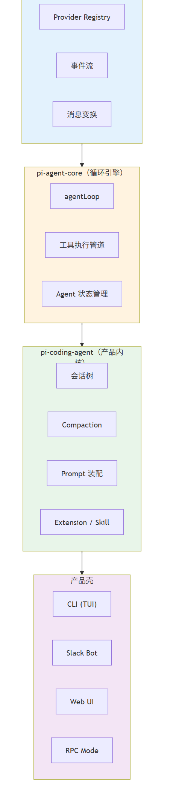
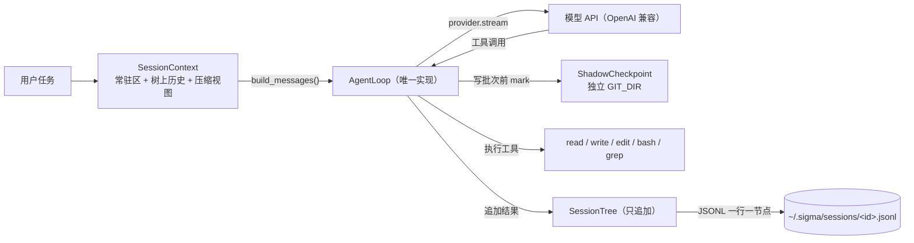

# sigma

**一个自研的 coding agent harness。目标不是功能数量，而是每一个设计决定都能被追问而不塌。**

[](https://github.com/wind-001/sigma-coding-agent/actions/workflows/ci.yml)


> **现状**（数字绑**本次提交**；换代码必须重跑，见[计数纪律](#计数纪律)）：
> P1 最小闭环 ✅ · P2 会话树 / 上下文 / 压缩 / 会话接续 ✅ · **P3-批次1 工具安全边界 ✅ · P4-批次1 技能系统 ✅**
> ——**498 单测全绿 · 三道门禁全绿（mypy strict 53 files / 契约 3 kept）· 81 条门槛注入全部可证伪 · 回放 6/6**。
> 未完成的部分不藏：评测任务集 70 条、压缩质量验收门、L3 钩子规则、skill 热重载（见[进度与未完成](#进度与未完成)）。

---

## 30 秒看懂它是什么

一个跑在终端里的编程助手：给它一条自然语言任务，它自己决定读哪些文件、改哪一行、跑什么命令。

```console
$ sigma -p "把 src/calc.py 里的 off-by-one 修掉，并跑一下测试" --workspace ./demo
sigma 0.0.1（一次性模式）
  工作区  /home/me/demo
  模型    deepseek-chat @ https://api.deepseek.com
  工具    ['bash', 'edit', 'grep', 'read', 'write']
  密钥    已加载（来源：环境变量 SIGMA_API_KEY）
  会话    sigma-20260922-155204-7f3a（新）
  联网    未启用（未找到 TAVILY_API_KEY）

  ⚠ 安全边界（不是沙箱）：
     L1 写路径：write/edit/bash 的 cwd 不得越出工作区（越界即拒绝）。
     L2 可回滚：每次写操作前自动快照；必要时用 sigma --rollback 退回。

⏺ grep({"pattern": "range\\(", "path": "src"})
  ✓ grep: src/calc.py:14: for i in range(len(items) + 1):
⏺ read({"path": "src/calc.py", "start_line": 10, "end_line": 18})
  ✓ read: [14 行] …
⏺ edit({"path": "src/calc.py", "old_string": "range(len(items) + 1)", "new_string": "range(len(items))"})
  ✓ edit: 已替换 1 处（unified diff）…
⏺ bash({"command": "python -m pytest -q"})
  ✓ bash: [stdout] 12 passed in 0.31s

修好了：src/calc.py 第 14 行多算了一个元素（+ 1），已去掉并跑通全部测试。
[completed · 4 轮 · prompt 6150 / completion 261]
```

（终端输出节选；循环、工具、渲染都是真实实现，`./demo` 由 `scripts/make_demo_workspace.py` 生成。）

## 三条差异化：它不是"又一层 LLM wrapper"

**1. 约束是机器强制的，不靠自觉。**
分层依赖不许反向 → `lint-imports` 三道契约。其中 `sigma_tools` 与 `sigma_session` 是**兄弟层**，
线性 `layers` 契约的语义只有"下层不许引用上层"、**默认放行一切向下 import**，
所以另配一条 `independence` 契约把兄弟关系钉死（实测过：只写 `layers` 时，
`sigma_tools → sigma_session` 是静默通过的）。
类型 → `mypy --strict`；行为 → 498 个单测。**CI 就这三条命令，跑不过不合。**

**2. 门槛必须是"可被证伪"的。**
73 条门槛，每条都配一次 **破坏 → 断言变红 → 还原 → 断言变绿** 的注入实验
（`scripts/gate_injection_*.py`）。写了断言却**没有任何注入能让它红** = 名义门槛，宁可删掉——
本项目真删过一条（`ruff`），也真否掉过一条（G57："回放工作区隔离"，实测无法证伪，故不注册）。

**3. 越界是"可回滚"，不是"拦得住"。**
`bash` 不做命令黑名单：`python -c`、base64、先写脚本再执行都能绕过字符串匹配，
那是自欺。取而代之的是 **影子 git checkpoint**——每个写批次**之前**自动打一次快照，
用**独立的 `GIT_DIR`**（`~/.sigma/sessions/<id>.shadow.git`），**绝不碰你自己仓库的 `.git`**；
出事就 `sigma --rollback` 整体退回，**包括删掉事后新建的文件**。



---

## 快速开始

### 1. 安装

```bash
python -m venv .venv
source .venv/bin/activate          # Windows: .venv\Scripts\activate
pip install -e ".[dev]"            # 运行期依赖只有 pydantic / httpx / python-dotenv
```

需要 Python **≥ 3.12**。

### 2. 配一个模型 key

只做 OpenAI 兼容协议（覆盖 DeepSeek / Kimi / GLM / 通义 / Ollama）。三种方式任选：

| 方式 | 做法 | 适用 |
| --- | --- | --- |
| 环境变量 | `export SIGMA_API_KEY=sk-xxx` | 临时切换；**不进 shell 历史**推荐用 `read -s` 或凭据管理器 |
| 用户级文件 | 写进 `~/.sigma/.env` | **推荐**：在仓库之外，不会被误提交 |
| 项目内文件 | 写进仓库根 `.env`（已被 `.gitignore` 覆盖） | 方便；安全性依赖 `.gitignore` 挡着 |

解析优先级：**命令行 `--api-key` > 环境变量 > `~/.sigma/.env` > 项目 `.env`**，
启动横幅会打印 key 的来源——"改了 `.env` 但没生效"这类问题不该靠猜。
环境变量名与可用预设见 [`.env.example`](.env.example)。

### 3. 跑一条任务

```bash
sigma -p "把 foo.py 里的 off-by-one 修掉" --workspace ./your-repo   # 一次性
sigma -i                                                            # 交互（跨轮记得上下文）
```

四种等价入口（逻辑只有一处，都在 `sigma.cli:main`）：

```bash
sigma -p "任务"          # console script
python -m sigma -p "任务"  # 通用；console script 不在也能跑
sigma.bat -p "任务"        # Windows cmd，也可双击进交互模式
.\sigma.ps1 -p "任务"      # PowerShell，也可右键"使用 PowerShell 运行"
```

退出码：**`0` = 正常结束（任务成没成都不影响）；非 `0` = harness 自身失败**；`130` = 用户中断。
把"任务没做对"混进退出码，会让"harness 崩了"和"模型没做对"无法区分，而 CI 只关心前者。

### 4. 安全边界与回滚（P3-批次1）

```bash
sigma --list-checkpoints                       # 看本会话有哪些快照（标签 + ref）
sigma --rollback                               # 退回"最近一次写操作之前"
sigma --rollback-to 4f5dfd9a                   # 退回指定快照（接受 ref 前缀）
sigma --no-checkpoint -p "任务"                 # 关掉快照（危险：破坏性操作不可回滚）
```

回滚**不启动模型**（它是人的动作，不是 agent 的一步），**也不需要 API key**——
模型密钥失效时恰恰是最需要回滚的时刻。执行回滚前会自动再打一次快照，
所以**回滚本身也可回滚**。

### 5. 可选：联网能力（两个独立开关）

| 工具 | 提供方 | 额度 | 硬闸 |
| --- | --- | --- | --- |
| `web_search` | Tavily | 1000 credits/月（basic 1 / advanced 2） | 用尽即禁用；结果进模型前先过黑名单 + 2 年时间预过滤，丢弃条数写回给模型看 |
| `web_fetch` | Firecrawl | 1000 credits/月（1 credit/页） | **单次最多 2 条 URL**；来源黑名单再拦一次；会话内另有抓取上限 |

有对应 key 才注册（工具 schema 占常驻上下文）；`--no-web-search` 可整体关掉；
额度账本落在 `~/.sigma/{tavily,firecrawl}_usage.json`，并用服务端用量端点校准。

### 6. 跑测试（不需要任何 API key）

```bash
pytest -q                 # 498 个单测
mypy core                 # strict
lint-imports              # 三条分层契约
python evals/runner.py    # 回放六个场景，报告落 evals/reports/
```

> **Windows / 沙箱环境两个坑**（都被踩过）：
> ① 用 `python -m pytest`，别直接调 `.venv/Scripts/pytest.exe`；
> ② 把临时根指进仓库（`TMPDIR=C:/path/to/repo/.pytest_cache/tmp`，**必须是 Windows 路径**），
> 否则 pytest 的 basetemp 只在系统 Temp 里只增不减。
> 还有一条纪律：**任何两个 pytest 进程都不要并行**（共用临时根会造成成片假红）。

---

## 架构

依赖方向严格受限，**由 CI 强制**：

```
sigma         → sigma_tools, sigma_session, sigma_agent, sigma_ai   # 产品壳
sigma_tools   → sigma_agent, sigma_ai                                # 工具层
sigma_session → sigma_agent, sigma_ai                                # 会话层
sigma_agent   → sigma_ai                                             # 循环与注册表
sigma_ai      → （无内部依赖）                                        # 协议层
```

`sigma_tools` 与 `sigma_session` 是**兄弟层，互不依赖**（由 `independence` 契约钉住）。

| 层 | 职责 | 关键文件 |
| --- | --- | --- |
| `sigma` | 产品壳：CLI / REPL / 一次性模式 / SDK 入口 | `cli.py` `sdk.py` `repl.py` `render.py` `dotenv.py` |
| `sigma_tools` | 内置工具与输出截断 | `read / write / edit / bash / grep` · `truncate` · `_paths`（L1 写路径约束）· `web_search / web_fetch`（可选） |
| `sigma_session` | 会话树 · 上下文组装 · 压缩 | `tree.py` `store.py` `context.py` `compact.py` `resources.py` `sessions.py` |
| `sigma_agent` | 唯一 agent loop · 工具注册表 · 观测事件 · 影子 checkpoint | `loop.py` `registry.py` `base.py` `agent_messages.py` `checkpoint.py` |
| `sigma_ai` | Provider 抽象与流式协议 | `base.py` `messages.py` `events.py` `openai/` `fake.py` |

### 一轮任务的数据流



### 上下文管理：两件事分开算

- **常驻区**（系统提示词 + 工具 schema + `AGENTS.md` + 技能索引）**≤ 3500 token，会话内逐字节稳定**——
  它是 prompt cache 的充要条件，所以 `SessionContext` 每次组装都校验**指纹**与**预算**两道，违反即崩
  （静默失效只是"变慢变贵"，不会报错）。`AGENTS.md` 硬截断到 800 token，且**截断标记写进正文**——
  模型看不见"被截断了"就会以为项目就这些约定。
- **压缩是视图，不是改写**：最旧的一段历史被压成一条摘要（降级成 `user`，绝不进常驻区），
  树上原文一个字节不动——改写历史会让"这条消息当时是否存在过"不可考，审计链就断了。
  触发线 = `(模型窗口 − 常驻区) × 0.8`，最近 4 轮原文保留。

## 安全边界（写清楚，不假装）

| 层 | 做什么 | 状态 |
| --- | --- | --- |
| **L1 写路径约束** | `write` / `edit` / `bash.cwd` 解析符号链接后必须仍在工作区内，越界即拒绝（`read` 不限制） | ✅ |
| **L2 影子 git checkpoint** | 写批次前自动快照；`sigma --rollback` 整体退回（含删除新增文件）；独立 `GIT_DIR` 不碰你的仓库 | ✅ |
| **L3 钩子规则** | 危险命令匹配（软边界，**只能减少不能消除**） | ⬜ 待做 |

**它仍然不是沙箱。** `bash` 会以你的用户权限执行**任意命令**：可以删工作区外的目录、
可以把数据发到网上、可以改环境变量。快照只覆盖**工作区内、未被 `.gitignore` 与 5 MB 上限排除**的文件。
完整清单（"钩子挡不住什么"）在 [`docs/architecture.md` 6.3 节](docs/architecture.md)，
不做容器的理由见 [`docs/decisions/D6`](docs/decisions/D6-不做容器隔离.md)。

## 质量体系：三道门禁 + 73 条门槛

**三道门禁**（CI 里就是这三条）：`lint-imports` · `mypy core`（strict）· `pytest`。

**73 条门槛**分布（每条都有一份注入实验证明它能红）：

| 批次 | 覆盖 | 条数 |
| --- | --- | --- |
| batch1 / 15 | 骨架契约、消息模型 | 7 + 10 |
| batch24 | loop / 注册表 / 截断 | 10 |
| batch6 | CLI 流式与 REPL | 6 |
| batch7 / 8 | 联网搜索与精读（额度硬闸、来源过滤） | 5 + 7 |
| p21 / batch9 | 会话树、存储替换语义 | 4 + 3 |
| batch10 / 11 | 上下文接树、`AGENTS.md` 预算、压缩 | 4 + 4 |
| batch12 | CLI 会话接续 | 4 |
| batch13 | **安全边界（L1 路径约束 + L2 回滚）** | 9 |

**一条门槛长什么样**（以 G68 为例——"回滚要删掉事后新建的文件"）：

```python
# src：checkpoint.py 用 reset --hard 而不是 checkout
reset = self._git("reset", "--hard", "--quiet", ref)

# 注入：把 reset 换成 checkout（架构 6.2 点名的坑：checkout 不删新增文件）
# 期望：tests/test_agent_checkpoint.py::test_restore_deletes_files_added_after_ref 变红
```

跑注入实验：`python scripts/gate_injection_batch13.py` → **9/9 被成功证伪**、
`scripts/gate_injection_batch14.py` → **4/4 被成功证伪**。

---

## 目录

```
core/           五个包（package-dir 指向 core/，所以它们是顶层包）
  sigma_ai/     协议层：Provider 抽象、消息模型、流式事件
  sigma_agent/  agent loop、工具注册表、观测事件、影子 checkpoint
  sigma_session/会话树、上下文组装、压缩、会话目录操作
  sigma_tools/  内置工具、输出截断、路径约束
  sigma/        产品壳：CLI / REPL / SDK 入口
tests/          498 个单测（不需要 API key）；fixtures/transcripts/ 是六个回放场景
evals/          评测运行器 + 报告（datasets/ 的任务集尚未落地，见下）
extensions/     运行时加载的扩展样例（P4）
docs/           架构方案、调研笔记、计划、决策记录
scripts/        门槛注入实验、真实 API 冒烟、demo 工作区生成
```

## 文档

| 文件 | 内容 |
| --- | --- |
| [`docs/architecture.md`](docs/architecture.md) | 架构方案（v1.6）：六项决策、消息模型两层结构、上下文预算、安全边界、可验证性设计 |
| [`docs/decisions/`](docs/decisions/) | ADR：D1 语言 / D2 harness 边界 / D3 扩展层形态 / D4 常驻区预算 / D5 安全边界 / D6 不做容器 |
| [`docs/plans/`](docs/plans/) | 各批次实施计划与验收记录（含门槛表、风险、实现中发现的问题） |
| [`docs/pi-harness研究笔记.md`](docs/pi-harness研究笔记.md) | 参照对象 Pi Agent Harness 的调研笔记，带来源可信度分级 |
| [`AGENTS.md`](AGENTS.md) | 本项目的开发约定（它同时是 sigma 自己的"项目说明"注入源） |

## 进度与未完成

| 阶段 | 状态 |
| --- | --- |
| P0 骨架 · P1 最小闭环（五工具 + CLI + 流式） | ✅ |
| 批次 7/8：联网搜索 + 精读（额度硬闸、来源过滤、调研纪律） | ✅ |
| P2-1…P2-5：回放评测 · 会话树 · 上下文接树 · 压缩 · CLI 会话接续 | ✅ |
| **P3-批次1：安全边界（L1 写路径 + L2 影子 checkpoint）** | ✅ |
| P3-批次2：HookManager + **L3 钩子规则** + steering | ⬜ |
| P4 扩展系统（运行时热重载） | ⬜ |
| P5 自证：数据集的基线 B0–B3 与消融 | ⬜ |

**明确未验收的**（写出来，不假装）：

- **`evals/datasets/` 的 70 条任务集未落地**（reproduce 20 / synthetic 30 / adversarial 20）。
  构造纪律已定死：`synthetic/` **必须先有会失败的测试、后有任务描述**，反过来会造出一批
  "本实现的水平恰好能过"的任务，评测就失去意义。
- **P2 第 3 条验收门（压缩前后成功率下降 ≤ 5%）未验收**：它需要真模型判定"压完还够不够用"，
  用回放录音算出来的"成功率"只是在数脚本对不对得上，与压缩质量无关。**未验收 ≠ 已通过。**
- **L3 钩子规则未做**，且它本来就是软边界。
- 顺带一条自我记录：曾试图加"回放工作区隔离"门槛（G57），**实测无法证伪，于是不注册**——
  宁可少一条门槛，不要一条名义门槛。

### 计数纪律

本文件里任何计数都必须绑定提交号。理由：批次 1.5 的代码曾"未提交就落在盘上"，
导致"104 个单测"这句话在提交历史里过期而无人察觉。这是「配置跑绿」的第三种形态——
**数字会随未提交代码漂移**。所以：换代码或换环境后，上面的数字**必须重跑**，不能照抄。

## 不做的东西，以及代替路径

砍功能必须给代替路径，否则"不做"看起来就是"没有"。

| 不做 | 代替路径 |
| --- | --- |
| 容器隔离 | 不做，安全边界写在架构文档里（见 D6） |
| MCP | 写一个扩展——扩展工具与内置工具走**同一条注册路径** |
| 子代理 | 在 REPL 里另开一个会话 |
| Plan Mode | 在任务描述里要求先输出计划，人工确认后再动手 |
| 待办追踪 | 让 agent 往会话目录写一个 markdown 文件 |
| 后台 bash | 用 `tmux` 或 `&` 自己跑，agent 只读输出 |
| Web UI / Slack Bot / RPC | 用 SDK（`create_session()` 是公开入口） |
| 多 Provider 抽象层 | 只做 OpenAI 兼容协议（已覆盖国内主流）；不做没有需求的设计 |
| SQLite 会话后端 | JSONL 追加写 + 内存索引；检索痛了再说 |
| TUI | 纯文本 REPL，避免拖累 CI |

## 许可

个人项目，暂未声明许可证。引用前请先联系作者。


