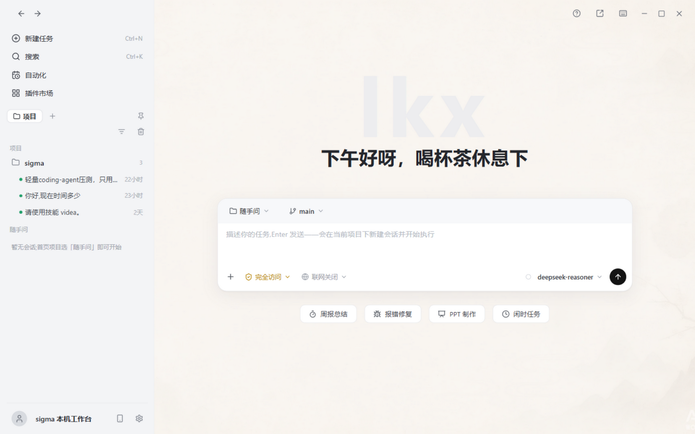
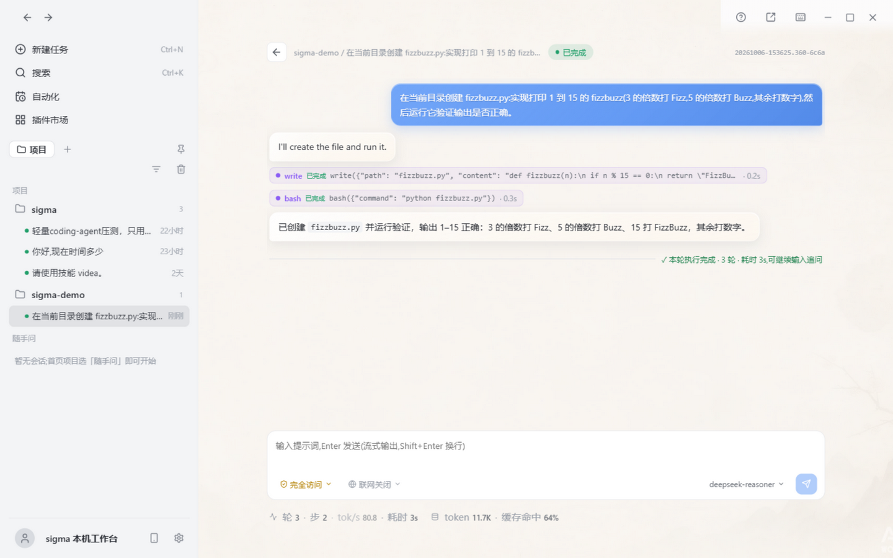
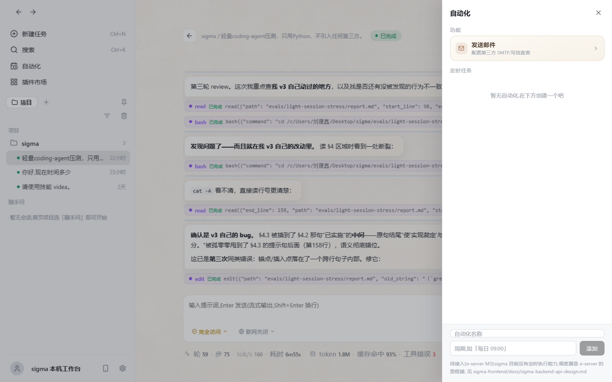
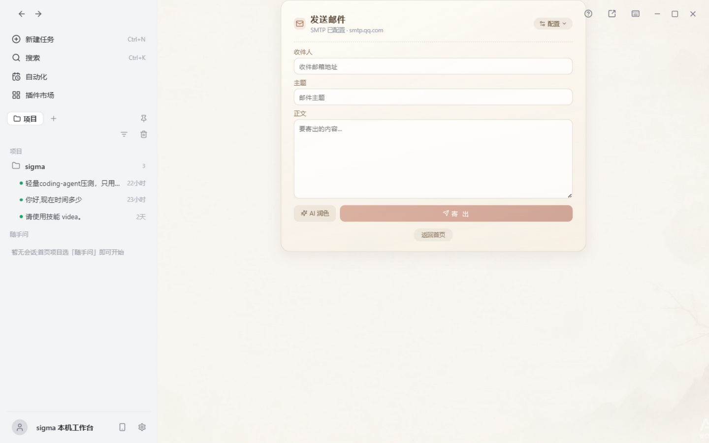
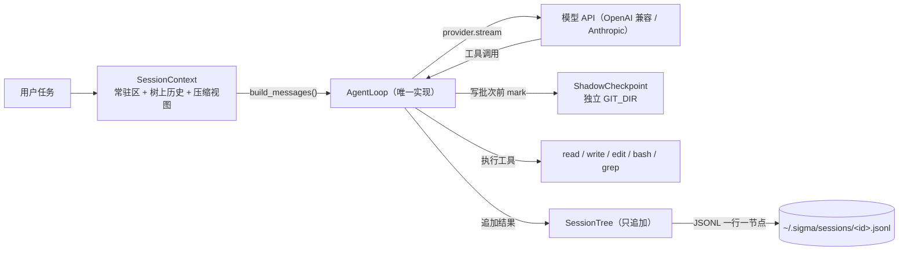

<div align="center">

# sigma

**自研 Python coding agent harness——目标不是功能数量，而是每一个设计决定都经得起追问。**

[](https://github.com/wind-001/sigma-coding-agent/actions/workflows/ci.yml)


*终端 agent · 多 agent 团队 · Web 工作台 · 可证伪的门槛体系*

</div>

---

## 目录

- [这是什么](#这是什么)
- [核心特性](#核心特性)
- [工作台](#工作台web-工作台)
- [快速开始](#快速开始)
- [架构](#架构)
- [安全边界](#安全边界)
- [质量体系](#质量体系)
- [评测](#评测)
- [项目结构](#项目结构)
- [文档](#文档)
- [路线图](#路线图)
- [设计取舍](#设计取舍)
- [许可](#许可)

## 这是什么

一个跑在终端和浏览器里的编程助手：给它一条自然语言任务，它自己决定读哪些文件、改哪一行、跑什么命令——并且**每一步都可以被审计、被回滚、被验证**。

```console
$ sigma -p "把 src/calc.py 里的 off-by-one 修掉，并跑一下测试" --workspace ./demo

⏺ grep({"pattern": "range\\(", "path": "src"})
  ✓ grep: src/calc.py:14: for i in range(len(items) + 1):
⏺ read({"path": "src/calc.py", "start_line": 10, "end_line": 18})
  ✓ read: [14 行] …
⏺ edit({"path": "src/calc.py", "old_string": "range(len(items) + 1)", "new_string": "range(len(items))"})
  ✓ edit: 已替换 1 处（unified diff）…
⏺ bash({"command": "python -m pytest -q"})
  ✓ bash: [stdout] 12 passed in 0.31s

修好了：src/calc.py 第 14 行多算了一个元素（+ 1），已去掉并跑通全部测试。
[completed · 4 轮 · prompt 6150 / completion 261]
```

它不是"又一层 LLM wrapper"。三条差异化，全部机器强制：

1. **约束是机器强制的，不靠自觉。** 15 个功能域子包按层排序，低层引用高层即 CI 失败（`lint-imports` 分层契约）；类型全量 `mypy --strict`；行为由 **1100 个单测**覆盖。CI 就这三条命令，跑不过不合。
2. **门槛必须可证伪。** 每条安全/行为门槛都配一次 **破坏 → 断言变红 → 还原 → 断言变绿** 的注入实验（21 份脚本、132 条实验）。写了断言却没有任何注入能让它红 = 名义门槛，宁可删掉——本项目真删过一条，也真否掉过一条。
3. **越界是"可回滚"，不是"拦得住"。** `bash` 不做命令黑名单（`python -c`、base64 都能绕过字符串匹配，那是自欺）。取而代之的是影子 git checkpoint：每个写批次之前自动快照，独立 `GIT_DIR` 绝不碰你仓库的 `.git`，`sigma --rollback` 整体退回、连事后新建的文件一起删。

## 核心特性

| 领域 | 能力 |
| --- | --- |
| **执行循环** | 唯一 AgentLoop：流式输出 · 中途打断 · steering / follow-up 双队列 · 断点续跑 |
| **工具系统** | read / write / edit / bash / grep / todo · 输出截断 · 额度账本 |
| **子 agent 与团队** | `task` 派发后台子 agent（独立上下文、并发上限）；`multi_agent` 拉起 pull 模式团队——任务板状态机 + 角色物理分权（worker / lead / scanner），越权在类型上不存在 |
| **多协议** | OpenAI 兼容 + Anthropic 双协议；自定义模型条目（base_url / model_id / 档位管线），密钥只落环境变量名不落明文 |
| **会话与上下文** | 会话树只追加（JSONL 审计链）· 常驻区指纹+预算双闸 · 压缩是视图不是改写 · 跨会话记忆 |
| **技能系统** | `extensions/skills/` 发现与渐进披露；扩展热重载（`/reload` 当轮生效） |
| **观测** | 每事件 trace 落盘 · `sigma --timeline` 精确到 TTFT · 通知与移动端访问 |
| **Web 工作台** | React 前端 + 本机桥接服务：会话管理 · 流式直播 · 审批卡 · ask_user 交互 · SMTP 邮件与 AI 润色 |
| **联网** | `web_search`（Tavily）与 `web_fetch`（Firecrawl）独立开关，额度硬闸 + 来源黑名单 |

## 工作台（Web 工作台）

浏览器里完成完整执行环：新建会话 → 流式直播 → 审批决策 → 会话管理。所有执行与 CLI 走同一套会话落盘、影子快照与 trace。

| 首页 · 自然语言任务入口 | 会话详情 · 工具调用与思考流 |
| --- | --- |
|  |  |

| 自动化 · 功能与定时任务 | 邮件 · SMTP 配置 + AI 润色 |
| --- | --- |
|  |  |

## 快速开始

### 1. 安装

```bash
python -m venv .venv
source .venv/bin/activate          # Windows: .venv\Scripts\activate
pip install -e ".[dev]"            # 运行期依赖:pydantic / httpx / python-dotenv / rich
```

需要 Python **≥ 3.12**。

### 2. 配一个模型 key

OpenAI 兼容协议覆盖 DeepSeek / Kimi / GLM / 通义 / LongCat / Ollama，另有 Anthropic 协议。三种方式任选：

| 方式 | 做法 | 适用 |
| --- | --- | --- |
| 环境变量 | `export SIGMA_API_KEY=sk-xxx` | 临时切换 |
| 用户级文件 | 写进 `~/.sigma/.env` | **推荐**：在仓库之外，不会被误提交 |
| 项目内文件 | 写进仓库根 `.env`（已被 `.gitignore` 覆盖） | 方便 |

解析优先级：**命令行 `--api-key` > 环境变量 > `~/.sigma/.env`**，启动横幅会打印 key 的来源。环境变量名与可用预设见 [`.env.example`](.env.example)。

### 3. 跑一条任务

```bash
sigma -p "把 foo.py 里的 off-by-one 修掉" --workspace ./your-repo   # 一次性
sigma -i                                                            # 交互（跨轮记得上下文）
sigma.bat -i                                                        # Windows
```

退出码：**`0` = 正常结束（任务成没成都不影响）；非 `0` = harness 自身失败**；`130` = 用户中断。把"任务没做对"混进退出码，会让"harness 崩了"和"模型没做对"无法区分，而 CI 只关心前者。

### 4. 安全边界与回滚

```bash
sigma --list-checkpoints                       # 看本会话有哪些快照（标签 + ref）
sigma --rollback                               # 退回"最近一次写操作之前"
sigma --rollback-to 4f5dfd9a                   # 退回指定快照（接受 ref 前缀）
sigma --no-checkpoint -p "任务"                 # 关掉快照（危险：破坏性操作不可回滚）
```

回滚**不启动模型**（它是人的动作，不是 agent 的一步），也**不需要 API key**——密钥失效时恰恰是最需要回滚的时刻。回滚前会自动再打一次快照，所以**回滚本身也可回滚**。

### 5. 启动 Web 工作台

```bash
python src/sigma-frontend/server/workbench_server.py     # http://127.0.0.1:8301
```

### 6. 跑测试（不需要任何 API key）

```bash
python -m pytest -q       # 1100 个单测
mypy src                  # strict,98 文件
lint-imports              # 两条契约:分层 + 禁引评测/扩展
```

> **Windows 环境两个坑**（都被踩过）：① 用 `python -m pytest`，别直接调 `.venv/Scripts/pytest.exe`；② 任何两个 pytest 进程都不要并行（共用临时根会造成成片假红）。

## 架构

依赖方向严格受限，**由 CI 强制**（完整层表见 [架构总览](docs/assets/sigma-architecture.visual-check.2048x1320.light.png)）：

```
sigma.cli            → 各功能域（视图侧装配）                       # 终端壳
sigma.sdk            → 组装一切（唯一装配点）                        # 装配层
sigma.observability  → hooks, sessions, agent, providers             # 观测层
sigma.runtime        → tools, security, hooks, sessions, events ...  # 核心循环
sigma.tools          → skills, security, agent, providers            # 工具层
sigma.security       → hooks, agent, events                          # 安全层
sigma.hooks          → sessions, events, agent                       # 钩子层
sigma.sessions       → agent, providers, config                      # 会话层
sigma.memory         → providers                                     # 记忆层
sigma.events         → agent                                         # 事件定义
sigma.agent          → providers                                     # agent 消息模型
sigma.prompts        → providers                                     # 提示词资产
sigma.config         → 无                                            # 配置层
sigma.providers      → 无（最底层）                                   # 协议层
```


### 一轮任务的数据流


```mermaid
flowchart LR
    U["用户任务"] --> CTX["SessionContext<br/>常驻区 + 树上历史 + 压缩视图"]
    CTX -->|"build_messages()"| LOOP["AgentLoop（唯一实现）"]
    LOOP -->|"provider.stream"| API["模型 API（OpenAI 兼容 / Anthropic）"]
    API -->|"工具调用"| LOOP
    LOOP -->|"写批次前 mark"| CP["ShadowCheckpoint<br/>独立 GIT_DIR"]
    LOOP -->|"执行工具"| TOOLS["read / write / edit / bash / grep"]
    LOOP -->|"追加结果"| TREE["SessionTree（只追加）"]
    TREE -->|"JSONL 一行一节点"| DISK[("~/.sigma/sessions/&lt;id&gt;.jsonl")]
```

### 上下文管理：两件事分开算

- **常驻区**（系统提示词 + 工具 schema + `AGENTS.md` + 技能索引）**预算分表管理（总额 5750 token，分项见 `resident_caps.py`），会话内逐字节稳定**——它是 prompt cache 的充要条件，所以 `SessionContext` 每次组装都校验**指纹**与**预算**两道，违反即崩。
- **压缩是视图，不是改写**：最旧的一段历史被压成一条摘要（降级成 `user`，绝不进常驻区），树上原文一个字节不动——改写历史会让"这条消息当时是否存在过"不可考，审计链就断了。

## 安全边界

| 层 | 做什么 |
| --- | --- |
| **L1 写路径约束** | `write` / `edit` / `bash.cwd` 解析符号链接后必须仍在工作区内，越界即拒绝（`read` 不限制） |
| **L2 影子 git checkpoint** | 写批次前自动快照；`sigma --rollback` 整体退回（含删除新增文件）；独立 `GIT_DIR` 不碰你的仓库 |
| **L3 审批拦截层** | 危险指令 / 越界写的**执行前确认**（allowlist 精确命中即免打扰；工作台里有审批卡）——软边界，**只能减少不能消除** |

**它仍然不是沙箱。** `bash` 会以你的用户权限执行任意命令。完整清单（"挡不住什么"）见 [架构文档 6.3 节](docs/architecture.md)，不做容器的理由见 [ADR D6](docs/decisions/D6-不做容器隔离.md)。

## 质量体系

**三道门禁**（CI 里就是这三条）：`lint-imports` · `mypy src`（strict）· `pytest`。

**每条门槛都配注入实验**：21 份脚本、**132 条实验**（破坏 → 红 → 还原 → 绿，脚本自报 `N/N 被成功证伪` 才算过）。示例（G68"回滚要删掉事后新建的文件"）：

```python
# src：checkpoint.py 用 reset --hard 而不是 checkout
reset = self._git("reset", "--hard", "--quiet", ref)

# 注入：把 reset 换成 checkout（checkout 不删新增文件）
# 期望：tests/test_agent_checkpoint.py::test_restore_deletes_files_added_after_ref 变红
```

> **计数纪律**：本文件任何计数都绑定提交号，换代码或换环境必须重跑，不能照抄——数字会随未提交代码漂移（本项目真发生过两次，详见 [技术债登记](docs/技术债登记.md)）。

## 评测

评测集三类，全部真实录制：

| 数据集 | 规模 | 结果 |
| --- | --- | --- |
| **adversarial**（对抗集） | 20 攻击 + 10 正常 | 拦截 **20/20** · 误拦 **0/10** · allowlist 免打扰 2/2 |
| **synthetic**（正式集） | 30 条 | **30/30**；每条初始失败均为真实录制，可解性经修复验证 |
| **ax**（能力评测） | 20 条 · 5 轴 | **B2(纠错) 20/20 · B0(裸模型) 8/20**——纠错增益 **+60pp** |
| 回放场景 | 6 条 | 6/6（本地环境；沙箱 PATH 缺解释器时 4/6,已登记环境债） |

自证数据（对照实验,非估算）：**缓存命中率 93.8%**（15 真实会话/138 轮）· **回滚 30/30** · 审批自证矩阵全过。逐项报告见 [`evals/reports/`](evals/reports/)。

## 项目结构

```
src/sigma/          唯一顶层包（src 布局,15 个功能域子包,97 文件 / 22,000 行）
  cli/              终端壳：CLI / REPL / 渲染 / 按键交互
  runtime/          核心循环：event_loop(AgentLoop)、sub_agent
  agent/            agent 层消息模型
  providers/        协议层：Provider 抽象、流式事件、OpenAI 兼容 + Anthropic 实现
  events/ hooks/    生命周期事件定义 · 钩子订阅者与总线
  tools/            工具基类、注册表、内置工具(task/multi_agent/ask_user/联网/todo…)
  skills/           技能发现与索引（渐进披露）
  sessions/         会话树、上下文组装、短期压缩
  memory/           跨会话记忆
  security/         路径沙箱(L1)、影子 checkpoint(L2)、审批门(L3)
  observability/    trace 逐事件落盘、timeline 视图
  prompts/ config/  系统提示词资产 · 密钥与常驻区预算表
  sdk.py            唯一装配层
tests/              1100 个单测（不需要 API key）
evals/              评测:adversarial 20+10 · synthetic 30 · ax 20 · 报告与运行器
src/sigma-frontend/ Web 工作台(React 前端 + stdlib 桥接服务)
docs/               架构方案、ADR、批次计划、技术债登记
scripts/            门槛注入实验(21 份) · demo 工作区生成
```

## 文档

| 文件 | 内容 |
| --- | --- |
| [`docs/architecture.md`](docs/architecture.md) | 架构方案：六项决策、消息模型、上下文预算、安全边界 |
| [`docs/decisions/`](docs/decisions/) | ADR：D1 语言 / D2 边界 / D3 扩展 / D4 预算 / D5 安全 / D6 不做容器 |
| [`docs/plans/`](docs/plans/) | 各批次实施计划与验收记录 |
| [`docs/技术债登记.md`](docs/技术债登记.md) | 只收有凭据的债（路径 + 现象 + 判据），清掉即删条 |
| [`AGENTS.md`](AGENTS.md) | 项目开发约定（同时是 sigma 自己的项目说明注入源） |

## 路线图

| 阶段 | 状态 |
| --- | --- |
| P0 骨架 · P1 最小闭环 · 批次 7/8 联网 · P2 回放/会话树/压缩/接续 | ✅ |
| P3 安全边界三层（写路径 / 影子 checkpoint / 审批）+ 双队列 | ✅ |
| P4 技能 · todo · sub_agent · 钩子统一通道 · 增量持久化 · rich 渲染 · 扩展热重载 | ✅ |
| P5 观测层 · 自证矩阵 · 跨会话记忆 · **多 agent 协作 v3(Pull 模式 + 角色分权)** | ✅ |
| P6 单包重构（15 功能域 + 分层契约 + ADR 体系） | ✅ |
| Web 工作台（执行环 · 流式 · 审批 · 邮件与 AI 润色） | ✅ |
| ax 能力评测 20 条 · 自证对照数据补齐 | ✅ |
| reproduce 数据集（方向待定） · 波 2 消融 · 压缩质量验收门 · 技能命中率实测 | ⬜ |

**明确未验收的**（写出来，不假装）：

- `reproduce/` 数据集 0/20,构造纪律已定死（先有失败测试、后有任务描述）。
- 压缩验收门（压缩前后成功率下降 ≤ 5%）需要真模型判定，**未验收 ≠ 已通过**。
- 技能"缓存命中率真的上去了"的结构性论证成立，命中率实测待对照实验。
- L3 只做危险指令匹配,挡不住 `python -c` / base64,清单一条都没消灭。

## 设计取舍

砍功能必须给代替路径；反过来，**此前"不做"的判断被推翻时，也记录在案**。

| 取舍 | 理由与代替路径 |
| --- | --- |
| 容器隔离 | 不做，边界写在架构文档（见 D6）；代替路径是 L1/L2/L3 软边界 |
| MCP | 不做接入层——写一个扩展，扩展工具与内置工具走同一条注册路径 |
| SQLite 会话后端 | JSONL 追加写 + 内存索引；检索痛了再说 |
| TUI | 2026-09 真机暴露布局塌缩后回退到纯文本 REPL（回退记录保留在批次计划里） |
| ~~子代理~~ → ✅ | 原判断"REPL 里另开会话"已过时:P4 落地 `task` 后台子 agent,P5 落地 `multi_agent` 团队 |
| ~~Plan Mode~~ → ✅ | 以 `access=plan` 档位落地 |
| ~~待办追踪~~ → ✅ | 以 `todo` 工具落地（A/B 消融验证） |
| ~~Web UI~~ → ✅ | 工作台已从只读回放演进为完整执行环 |
| ~~多 Provider 抽象~~ → ✅ | Anthropic 协议以镜像实现落地（三闸逐值镜像,不共享） |

## 许可

个人项目，暂未声明许可证。引用前请先联系作者。
