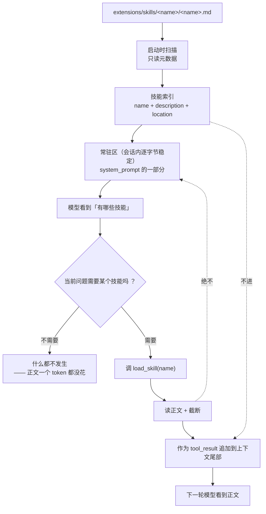

# P4-批次1：Skill 系统（渐进披露）详规

> 提出日期：2026-09-22 22:43 ｜ 状态：**待审阅——本文件只落方案，未落码**
> 归属阶段：**P4 扩展系统**（架构 §9 第 1277 行）
> 需求来源：星辰 2026-09-22 口述（原文见 §0.1）

---

## 0. 先回答三个会决定方案形状的问题

### 0.1 星辰的原始设想（原样记录，便于对照）

1. 改造 `system_prompt`，**提高这一部分的上限**，为后续 skill 与 tool 的渐进式披露做缓冲；
2. 会话开始时注入 `system_prompt`，里面包含 skill 的 `name` / `description` / `location` 字段；
3. 模型根据当前问题决定是否调用「注入 skill 的工具」，**把 skill 正文放进 context，不进 system_prompt**，实现动态加载；
4. `extensions/skills/` 下放**一个专门统计所有已知 skill 的文件**，系统把**该文件**加到 `system_prompt`。

### 0.2 逐条评估

| # | 你的设想 | 我的判断 | 处置 |
| --- | --- | --- | --- |
| 1 | 提高上限 | **不需要提高 D4 的 3500** —— 实测最满 3415/3500（§6）。**但 5.1 表里"系统提示词 ≤800"这一行会不够**：282 + 索引 600 = 882 | 改**分项归属**，不动总数（§6） |
| 2 | 索引注入常驻区 | ✅ 对，且与架构 §5.1「技能索引 ≤600」完全一致 | 照做 |
| 3 | 正文进 context 不进 prompt | ✅ **完全正确**，而且比 Pi 的说法更硬（§3） | 照做 |
| 4 | 一个统计文件 | ⚠️ **会漂移**：加了 skill 忘更新清单 → 模型看不到它，**且不报错** | 见 §5（两个方案 + 推荐） |

**一句话结论**：你的 2、3 两条是对的，而且第 3 条恰好回答了研究笔记标为"要实测"的那个坑；
第 4 条是**唯一有真实风险**的地方。

---

## 1. 目标与非目标

**目标**

1. `extensions/skills/<name>/<name>.md` 放下一个技能，**改文件即生效**（无需改代码）；
2. 会话开始时，**只有目录**（name + description + location）进常驻区；
3. 模型判断需要时，调一个工具把正文拉进**上下文尾部**；
4. 索引在整个会话内**逐字节稳定**（D4），正文按需追加（架构 §5.2 规则二）。

**非目标（明确不做，避免被读成"忘了"）**

- **不做** skill 的热重载（属 P4 后面批次；本批只做"启动时扫描"）；
- **不做** skill 的参数化调用（Pi 的 Prompt Templates 是另一个机制）；
- **不做** skill 之间的依赖/组合；
- **不做** 从网络安装 skill。

---

## 2. 核心机制：两条注入路径



**读图要点**：**索引走常驻区，正文走尾部**。这两条路一个是"稳定的、可缓存的"，另一个是"只追加的"。
下一节说明为什么这个分法是对的。

---

## 3. 为什么"渐进披露不破坏 prompt cache"在这里是**结构成立的**

研究笔记第 310 行把这件事标成了**需要实测的工程权衡**：

> Pi 声称的「按需加载但不爆缓存」是一个具体工程权衡，**自研时要实测，不要默认成立**。

**你的设计把它从"声称"变成了"结构保证"**，理由两条：

1. **常驻区那份是稳定的**：索引在会话开始时算一次、之后不变。
   prompt cache 的前提（前缀逐字节相同）由 D4 那条断言强制 —— `SessionContext.verify_resident_region()` 每轮校验，变了直接抛（门槛 G26/G50）。
2. **正文那份只追加**：`load_skill` 的产物是 `tool_result`，它 **append 到消息尾部**。
   **追加不改变前缀**，所以前面整段（含索引）的缓存**仍然命中**。

**反例**（说明为什么不能"把正文拼进系统提示词"）：那样每加载一个技能，
系统消息就变一次 → 前缀从变化点起全部失效 → **每加载一次技能，之前所有缓存白建**。
这正是架构 §5.2 规则一、以及第 1028 行那句「技能正文**不能**插在常驻区」在防的事。

> ⚠️ **仍然要实测的那部分**：上面证明的是"**结构上不会破坏前缀**"。
> 但"缓存**命中率**有没有真的上去"是另一回事（受 provider 的分段策略影响）。
> 这一条留给 §9 的对照实验，**不在这里宣称成立**。

---

## 4. 数据模型与落点

### 4.1 数据模型

```python
class SkillMeta(BaseModel):
    """一个技能在索引里的样子。**三字段，与星辰要求一致。**"""
    name: str          # 唯一标识，也是 load_skill 的参数
    description: str   # 一句话说明"什么时候该用它"
    location: str      # 相对路径，供人核对；模型一般不需要它来调用
    source: Path       # 绝对路径，运行时用（不进索引文本）
```

**为什么 `location` 要进索引**（你的要求）：它是**给人核对用的** ——
模型说"我要用 image 技能"时，人能立刻找到那个文件。
**代价**是全路径很长（`extensions/skills/image/image.md` 约 34 字符 ≈ 11 token/条）。
**建议只放相对路径**，理由见 §9 Q3。

### 4.2 落点

| 文件 | 放什么 | 为什么在这 |
| --- | --- | --- |
| `core/sigma_agent/skills.py`（新） | `SkillMeta` · `discover_skills(root)` · `render_index(skills)` · `load_body(meta)` | **`sigma_agent` 是 `sigma_tools` 与 `sigma_session` 共同的依赖**，放这里两边都能用且不违反兄弟层契约（见 §4.3） |
| `core/sigma_tools/skill.py`（新） | `LoadSkillTool`（第 8 个内置工具） | 工具实现归工具层 |
| `core/sigma_session/context.py`（改） | 常驻区多一段"技能索引" | 常驻区只有它在管 |
| `core/sigma/sdk.py`（改） | 扫描 → 渲染索引 → 交给 `InteractiveSession` | 产品壳决定"去哪扫、扫不扫" |

### 4.3 ⚠️ 一个必须说清的分层问题

**`sigma_tools` 不能 import `sigma_session`** —— 它们是**兄弟层**，由 `independence` 契约在 CI 强制。

所以"技能发现"**不能**放在 `sigma_session/resources.py`（架构第 338 行的原始设想），
否则 `LoadSkillTool` 要么违反契约，要么自己重写一份扫描逻辑（**两份实现会漂移**）。

**处置**：把技能元数据放在 **`sigma_agent/skills.py`** —— 它是两边的公共下界，
且"注册表"本来就是 agent 层的概念（`ToolRegistry` 就在那儿）。
架构第 338 行那处注释需要跟着改（§9 Q2）。

> 备选（若你不认可放 agent 层）：**由产品壳把 `skills` 列表当构造参数传给工具**，
> 工具完全不 import 发现逻辑。**代价**是发现逻辑仍要有个家 —— 还是得选一层。
> 我推荐前者，因为 `ToolRegistry` 已经确立了"注册表住 agent 层"的先例。

---

## 5. 索引从哪来：目录扫描 vs 清单文件（**本批最需要拍板的一条**）

### 方案 A：**目录即真相**（推荐）

扫描 `extensions/skills/*/*.md`，从每个文件的 **frontmatter** 取 `name` / `description`：

```markdown
---
name: image
description: 生成与编辑图片。当用户要配图、改图、做视觉素材时用它。
---

（正文……）
```

- ✅ **不可能漂移**：加了目录就有索引，删了目录就没了索引；
- ✅ 新增技能只改一处（那个 md 文件本身）；
- ❌ 每个技能文件必须带 frontmatter（多四行）；
- ❌ 需要处理"frontmatter 缺失/非法"这类坏输入。

### 方案 B：**一个清单文件**（你原本的设想）

`extensions/skills/index.md` 手工列出所有技能，系统把它整体塞进 system_prompt。

- ✅ 最简单，索引文本可直接人工润色排序；
- ❌ **会漂移**：新建了 `videa/videa.md` 但忘了写进 `index.md`
  → 模型**永远不知道有这个技能**，而且**不报错**。
  症状是"我明明加了技能，它怎么不用" —— 而这正是本项目反复吃的亏
  （「两套表示会漂移」）。

### 方案 C：A + B（折中）

目录扫描出**事实**，清单文件只用来**排序与人工润色**；
启动时校验"清单里的每一项都存在、目录里的每一个都出现在清单里"，
**不一致就响亮报错**。

**我的推荐**：**A**。理由：B 的收益（人工排序）在这个阶段没有需求，
而它的风险（静默漂移）是真金白银。若你坚持要清单（比如为了给技能分组），**走 C**，
但那条一致性校验**必须有**，且要有注入实验证明它会红。

---

## 6. 预算实测（**数字绑本次实测，不是照抄**）

口径 = `sigma_ai.tokens.estimate_text`（chars/3 粗估）：

| 项 | token |
| --- | --- |
| 工具 schema（5 核心） | 1057 |
| 工具 schema（+两席联网） | 1768 |
| 系统提示词（核心五工具 / +两席） | 127 / 282 |
| `AGENTS.md` 上限 | 800 |
| **技能索引 计划上限** | **600** |
| **最满合计** | **3415** |
| D4 上限 | 3500 |
| **余量** | **85** |

**两个结论**：

1. **不需要提高 D4**（3415 ≤ 3500，架构 §5.1.2 在 P2-3 就算过这笔账）。
2. **但 5.1 表里"系统提示词 ≤ 800"这一行会不够**：索引要拼进提示词，
   `282 + 600 = 882 > 800`。
   **处置**：把技能索引在表里**单列一行**（像 `AGENTS.md` 那样），
   而不是算进"系统提示词"那一行。**总数不变，只是归属更精确。**

**600 token 能装多少技能？**
一条索引约 45 字符 ≈ 15 token（`- image：生成与编辑图片。→ skills/image/image.md`）
→ **600 token ≈ 40 条技能**。两个技能的当前规模下，实际占用约 30 token。

> ⚠️ **余量只有 85**。这意味着：**这一批之后，常驻区不能再加任何东西**，
> 除非先砍掉别的。这条要写进 §9 的待办，作为对下一批的硬提醒。

---

## 7. 接口设计

### 7.1 `sigma_agent/skills.py`

```python
def discover_skills(root: Path) -> tuple[list[SkillMeta], list[str]]
    """扫描 root 下一级目录里的 <name>/<name>.md。

    返回 (技能列表, 问题列表)。**不抛异常**——一个坏技能文件不该让会话起不来
    （与 load_project_instructions 对"读不出来"的处置一致）。
    问题清单必须能被调用方拿到并展示（丢弃必须可见）。
    """

def render_index(skills: Sequence[SkillMeta]) -> str
    """把技能列表渲染成常驻区里那段文本。
    **按 name 排序**——顺序不稳定 = 常驻区不稳定 = G26 天天误报。
    """

def load_body(meta: SkillMeta, *, max_tokens: int) -> str
    """读正文并截断。截断标记写进正文（丢弃必须可见，同 resources.py）。"""
```

### 7.2 `sigma_tools/skill.py`

```python
class LoadSkillTool(BaseTool):
    name = "load_skill"
    params = LoadSkillParams        # name: str
    read_only = True                # 只读 → 可与其它只读工具并发
```

- **只读**：所以它能进 `_execute_batch` 的并发分支；
- **失败形态**：名字不认识 → `is_error` 结果 + **列出可用的名字**
  （否则模型只能瞎猜，而它没有全量列表可查）；
- **截断**：技能正文可能很长，走 `truncate.py` 那条既有路径。

---

## 8. 门槛（每条都要能被注入证伪）

| 编号 | 门槛 | 注入方式 |
| --- | --- | --- |
| **G75** | 技能索引**进常驻区**且**逐字节稳定** | 让 `render_index` 按文件系统顺序输出（不排序）→ 两次扫描顺序不同 → 指纹变 |
| **G76** | 技能**正文不进常驻区** | 把 `load_body` 的结果拼进 `_resident_text()` → 加载一次后常驻区指纹变 |
| **G77** | `load_skill` 认不出名字时**给可用列表** | 删掉错误分支里的名字列表 → 断言"结果里含可用技能名"变红 |
| **G78** | frontmatter 缺失的技能**被报告而不是静默跳过** | 让 `discover_skills` 静默跳过坏文件 → 断言"问题清单非空"变红 |
| **G79**（若走方案 C） | 清单与目录不一致时**响亮失败** | 让校验直接 return → 不一致时不报错 |

> **G76 是这一批最重要的一条**：它把"正文绝不进常驻区"从注释变成不可违反的约束。
> 这一条与 P2-3 的 G51b 同源（当时是"压缩摘要不进常驻区"）。

---

## 9. 待拍板项（回编号即可）

| # | 问题 | 我的推荐 |
| --- | --- | --- |
| **Q1** | 索引来源：**目录扫描（A）** / 清单文件（B） / A+校验（C） | **A**。B 会静默漂移，而收益（人工排序）当前没有需求 |
| **Q2** | 技能元数据放**哪一层**？（`sigma_agent/skills.py` vs 别的） | **`sigma_agent`**。放 `sigma_session` 会让 `sigma_tools` 违反兄弟层契约 |
| **Q3** | 索引里 `location` 放**相对路径**还是绝对路径？ | **相对路径**。绝对路径约 +40 字符/条，而模型不需要它来调用 |
| **Q4** | 技能正文的**截断上限**是多少 token？ | **1500**（约 4500 字符）。一个技能正文通常 1–3 KB |
| **Q5** | skill 与 tool 的**渐进披露**：本批是否同时改工具？ | **不同时做**。先把 skill 这条链路打通并证伪，工具侧另开一批 |
| **Q6** | 索引注入的位置：拼在系统提示词的**末尾**还是**项目说明之后**？ | **末尾**（`_resident_text()` 的最后一段）。理由：AGENTS.md 是"人的约定"，索引是"能力目录"，两者性质不同，放最后更易读 |
| **Q7** | 要不要**先把 `extensions/skills/` 里那两个 0 字节文件填上内容**？ | **要**。空文件会让 frontmatter 校验全红，那会掩盖真正的实现问题 |

---

## 10. 溯源表（Pi 对照）

| Pi 的做法 | 本方案 | 采用 / 不照抄 / 暂缓 |
| --- | --- | --- |
| Skills 是"能力包，按需加载" | 索引常驻 + 正文按需 | **采用**（笔记 304 行） |
| "按需加载不破坏 prompt cache" | 分两条路（稳定 / 只追加） | **采用思路，但要求可证伪**——笔记 310 行明确说"不要默认成立"，故设 G76 |
| Pi Package（npm/git 分发） | — | **暂缓**：本项目没有分发需求；加进来是负债 |
| Prompt Templates（`/name` 展开） | — | **暂缓**：与本批的 skill 是两个机制，混在一起会让两边都含糊 |
| `SYSTEM.md` 替换/追加系统提示词 | 索引拼进 `_resident_text()` 末尾 | **不照抄**：本项目已有 `AGENTS.md` 的注入路径，再加一条会形成两个入口 |
| 技能内容"每轮注入同一段"可缓存 | 索引稳定 + 正文追加 | **采用**（笔记 310 行的前半句） |

---

## 11. 工作量与顺序（若按推荐值落地）

1. `sigma_agent/skills.py` + 单测（frontmatter 解析、坏输入、排序稳定）
2. 填 `extensions/skills/` 两个 skill 的内容
3. `SessionContext` 接技能索引（常驻区第三段）+ 单测
4. `sigma_tools/skill.py` + 单测
5. `sdk` / `cli` 接线 + 横幅显示"已发现 N 个技能"
6. 门槛 G75–G78 + 注入实验（`scripts/gate_injection_batch14.py`）
7. **重跑 batch1–batch13**（元纪律②：本批会改 `context.py`，E24 锚点可能位移）
8. 文档：architecture §5.1 表（技能索引单列）、第 338 行注释、`extensions/README.md`、设计逻辑加图

> **第 7 步不能省。** 这是本项目已经吃过两次亏的地方（P2-3 的 E24、P4 之前的 batch6 E34）。

---

## 12. 实现记录：P4-批次1 技能系统（已完成）

**状态：✅ 完成。** 落盘时刻 **2026-09-22 23:xx**，对应 §11 的八步。

### 12.1 交付物

| 文件 | 内容 |
| --- | --- |
| `core/sigma_agent/skills.py`（新） | `SkillMeta` · `SkillScan` · `parse_frontmatter` · `strip_frontmatter` · `discover_skills` · `render_index` · `load_body` |
| `core/sigma_tools/skill.py`（新） | `LoadSkillTool`（第 8 个内置工具，只读） |
| `core/sigma_ai/tokens.py`（改） | 新增 `TruncatedText` · `Marker` · `truncate_to_tokens` —— **把"按 token 截断且让丢弃可见"收成一处实现** |
| `core/sigma_session/resources.py`（改） | 改用上面那个共享实现（**删掉了自己那份 `_compose_truncated`**） |
| `core/sigma_session/context.py`（改） | 常驻区加第三段"技能索引"；新增公开的 `resident_text()` |
| `core/sigma/sdk.py`（改） | `scan_skills()` · `default_registry(skills=…)` · `build_system_prompt(skills=…)` · `InteractiveSession` 自动扫并补注册 `load_skill` |
| `core/sigma/cli.py`（改） | `--skills-dir`；横幅打技能数与**问题清单** |
| `extensions/skills/{image,videa}/` | 从 0 字节填成真实示例技能 |
| `tests/test_agent_skills.py`（新） | **31 个用例** |
| `scripts/gate_injection_batch14.py`（新） | G75–G78（4/4 可证伪） |

### 12.2 实测数字（绑本次提交）

- `pytest -q` → **498 passed**（467 → 498，新增 31）；
- `mypy core` → **53 files clean**；
- `lint-imports` → **3 kept, 0 broken**（**兄弟层契约没被破坏** → `skills.py` 放 `sigma_agent` 是对的）；
- 注入实验 → **81/81**（原 73 + batch14 的 4，以及 batch13 的 9 已含在 73 内）；
- 回放场景 → **6/6**；无注入残渣。

**常驻区实测（两席联网全开 + 满额 AGENTS.md + 两个技能）**：

```
工具 schema 8 个  1931   （其中 load_skill 净增 163）
系统提示词         282
AGENTS.md          104
技能索引            57   （2 个技能）
────────────────────────
合计              2374   ≤ 3500 ✓
```

### 12.3 对需求的三处处置（与 §0.2 的评估一致）

1. **没有提高 D4 的 3500**，也没有提高"系统提示词 ≤800"——
   而是**重新分配了 5.1 表的分项 cap**。原因见 architecture §5.1.0：
   **旧表五条 cap 相加是 4050，从来没在 3500 里装下过**（这条是本次才发现并修的）。
2. **索引来源用 A（目录扫描 + frontmatter）**，不是手工清单——
   手工清单会静默漂移（见 §5 的失败推演）。
3. **正文进 context 不进 system_prompt**：完全按需求做，且 §3 给出了
   "结构上不破坏前缀"的论证（**但没宣称命中率上升**，那要对照实验）。

### 12.4 三处施工发现

1. **`render_index` 里 `location` 的信息量问题**：一开始的约定是
   `skills/<name>/<name>.md`，那样 `location` 恒等于 `<name>/<name>.md`，
   **一个字的额外信息都没有**。改成"目录里那唯一的 `.md`"之后它才有意义
   （可以有 `alpha/SKILL.md`）。**一个字段是否值得占常驻预算，要看它是否可被推导。**
2. **顺序稳定性不能靠文件系统**：`discover_skills` 里显式 `sort`，
   而且门槛注入特意选了**倒序**而不是"删掉排序"——
   后者在本机可能构造不出红（本机文件系统恰好按名字返回时结果一样），
   那会变成"实验无效"而不是"门槛有效"。
3. **`_resident_text()` 的锚点必然位移**：batch11 的 E66 注入锚在它上面，
   本次改成三段式后锚点失效——**它响亮地抛了 `AssertionError`**，
   没有伪装成通过。已按新写法修锚点，注入意图一字未改。

### 12.5 连带：全部注入重跑

本批改了 `context.py` / `sdk.py` / `cli.py` / `resources.py`，按元纪律②重跑 **batch1–batch14**：
**7+10+10+6+5+7+4+3+4+4+4+9+4 = 81/81**，另 `gate_injection_p2_compaction.py` 2/2。

> 下一步（P4-批次2 候选）：扩展热重载、`before/afterToolCall` 钩子、以及
> 技能侧的二级索引（>15 个技能时）；或回到 P2-7（文档 + 自举端到端验收）。
