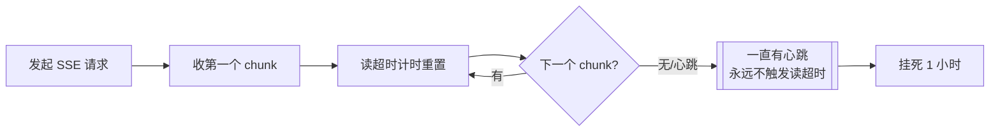
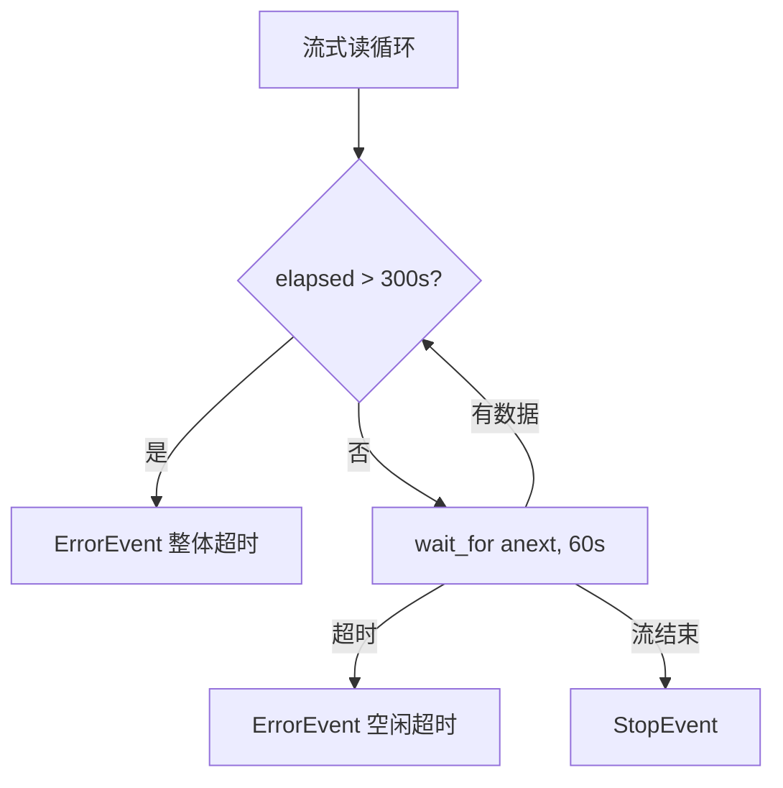

# P4-批次3：子 agent 轮数预算三档 + 流式响应超时双闸 详规

> 立项：2026-09-24（承接 09-23 轮数扫描暴露的两件事）
> 状态：✅ 已落地（2026-09-24。注入门 G80–G89 十条全红）
> 前置阅读：`P4-task工具-sub_agent-详规.md`（task + 信箱）、`P4-批次2` 详规（消融 + 回报）

## 0. 背景：一次事故 + 一个无凭据的常数

2026-09-23 晚的轮数扫描（2 条复杂任务 × 4 档）同时暴露两件事：

1. **r10 / r40 两档挂死 1 小时零产出**——同一时刻 r20/r30 每轮 4 秒完成。
2. **子会话轮数是写死的 50**——没有实测支撑，且单次子任务的成本上限被抬到
   ~450k token。

两者都不是功能缺失，都是**"看起来能用、实际没有凭据"**的东西。

## 1. 流式响应超时：为什么 `httpx.Timeout(120)` 挡不住

### 缺陷机理



`httpx.Timeout(120.0)` 约束的是**单次读**——SSE 每收到一个 chunk（含心跳）
就重置计时。模型侧只要定期发心跳，**读超时永远不触发**。它防得住"半天没动静"，
防不住"一直有心跳但不出内容"。

### 双闸设计

两个闸**语义互不污染**（这是实现里踩过的坑：把 `min(idle, 剩余总时长)`
传给 `wait_for` 会让"总时长耗尽"被误报成"空闲超时"）：

| 闸 | 位置 | 取值 | 依据 |
| --- | --- | --- | --- |
| 空闲闸 | `asyncio.wait_for(anext, idle)` | **60 s** | 厂商心跳间隔常见 15–30 s；正常首 token <5 s、高峰 <30 s。60 s = 心跳间隔 2–4 倍，不误伤 |
| 总时长闸 | 循环顶部检查 `elapsed > total` | **300 s** | 实测单轮 3–30 s（r20/r30 每轮约 4 s），最坏 ~90 s；300 s 是它的 3 倍以上 |



**丢弃必须可见**：两者都产出 `ErrorEvent(code=TRANSIENT)`，不是静默截断。
（对应判据「丢弃必须可见（写回 content）」）

**可测试性**：两个闸都做成构造参数（`stream_idle_timeout_s` /
`stream_total_timeout_s`），用例传 0.1 s 级别的值 → 秒级验证，无需真等一分钟。

注入门：**G87**（总闸失效）/ **G88**（空闲闸失效）——注入后对应的用例
**确定性变红**（不是 hang：用例里的流会在注入后正常走完，于是"没有 ErrorEvent"
让断言失败）。

## 2. 子 agent 轮数预算：三档

### 取值与凭据

| 档 | 轮数 | 凭据（全部是本项目实测，不是拍脑袋） |
| --- | --- | --- |
| `low` | **10** | 修 bug 短任务实测最短 7 轮（syn-002）／A/B 试水 7–9 轮；10 = 7 × 1.4 |
| `medium` | **20** | 短 bug 修复实测 7–16 轮（syn-001…010 的 B2 臂）；20 = 16 × 1.25，且与主任务默认 `max_rounds` 一致 |
| `high` | **30** | 两条复杂任务实测 23 / 25 轮完成（syn-012 / syn-011）；30 = 25 × 1.2 |

**为什么不再保留 50**：50 轮 × 实测每轮 3–9k prompt ≈ 单次子任务上限 450k token，
而 r20 → r30 的边际收益已经归零（两条复杂任务 23 / 25 轮就完成了）。
**50 是无凭据的虚高；30 有实测支撑。**

**为什么低于 23 会坏**：syn-011 在 r20 的失败形状就是"修到只剩 1 处 bug 被掐断"——
所以 high 必须 ≥23 且留余量，取 30。

### 谁判断难度

```mermaid
flowchart LR
    A[主 agent 拆计划] --> B{task dispatch<br/>difficulty=?}
    B -- low --> C[10 轮]
    B -- medium --> D[20 轮 默认]
    B -- high --> E[30 轮]
    C --> F[子会话跑完 / 跑满被掐]
    F -- stopped --> G[回报带"未正常收尾"注记]
    G --> A
```

**判断难度的是派发的模型**，不是代码启发式：

- 代码只能看描述长度之类的表面特征——那是循环论证（"长描述 = 难"没有证据）。
- **主 agent 刚拆完计划，它是唯一知道子任务难度的一方**。
- 猜错了也不致命：子会话跑满预算 → `stopped` → 回报带"未正常收尾"注记 →
  主 agent 可以立刻用 `high` 重派。**闭环是通的**，这就是 low 敢设 10 的原因。

**预算对模型可见**：dispatch 回执写明"轮数预算 30（难度 high）"——
模型知道预算，才知道要不要重派、要不要把子任务拆细。

### 改动面

- `sigma_tools/task.py`：`SubAgentRounds`（三档 BaseModel）+ `TaskParams.difficulty`
  （Literal，默认 medium）+ 工厂签名加 `max_rounds`
- `sigma/sdk.py`：`sub_agent_rounds: SubAgentRounds | None`（替换原 `sub_agent_max_rounds=50`）
- `sigma_ai/openai/provider.py`：双闸 + 两个可注入常量

## 3. 实现记录（2026-09-24）

| 项 | 结果 |
| --- | --- |
| 新增/改动文件 | `core/sigma_tools/task.py`、`core/sigma/sdk.py`、`core/sigma_ai/openai/provider.py` + 3 个测试文件 |
| 注入门 | G87（总闸）/ G88（空闲闸）/ G89（档位表绕过 → 一律 high）→ **10/10 全红** |
| 常驻区代价 | `TaskParams.difficulty` 一个 Literal 字段 ≈ +30 token。**已知**：最满总账仍超闸（历史欠账 450，待 5.1 表重排裁决），本次不加码对冲——字段说明已压到最短 |

**踩过的坑（写进判据手册）**：

1. 两个超时闸不能共用一个 `wait_for` 超时值——`min(idle, 剩余总时长)`
   会让"总时长耗尽"被误报成"空闲超时"。
2. 后台 bash 并行编排：`A && B & C &` 会把函数定义链进第一个后台 job；
   含参数的变量（`PY="exe -u"`）加引号会被当成单个文件名。**用 `;` 分隔定义、
   含参变量不加引号**。
