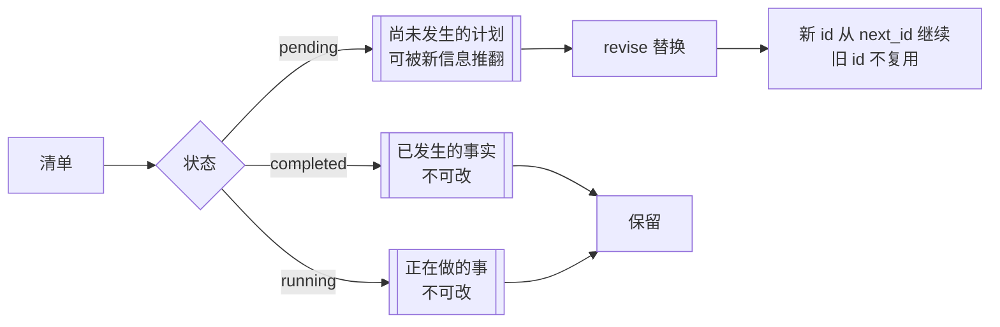

# P4-批次4：todo 清单可演进（revise + 难度系数）详规

> 立项：2026-09-24 ｜ 需求方：星辰
> 状态：✅ 已落地（2026-09-24。注入门 G80–G90 十一条全红）
> 前置阅读：`P4-任务清单工具-详规.md`（todo 状态机 + steering）、`P4-批次3` 详规（子 agent 三档预算）

## 0. 需求原话（星辰）

> todo 工具拆解的任务清单不是一成不变的，它只是**最初版本**。如果 agent 在执行任务
> 的过程中发现后续任务设计不合理，一样是可以优化任务列表布局的——因为进行任务的
> 过程中会对任务进行深度、细粒度的拆解思考，从而对后续任务的难度系数、任务列表
> 拆解的合理性进行优化。

一句话：**计划随执行进化**。

## 1. 为什么需要第四个动作，而不是扩展 create / update

| 动作 | 语义 | 能不能干这件事 |
| --- | --- | --- |
| `create` | 全量重建（要 `overwrite=true`） | 能，但会**抹掉已完成的历史**——"推翻重来"，不是"调整后续" |
| `update` | 改单条（状态 / 说明） | 不能增删条目、不能重排 |
| **`revise`** | **只换未开始的部分** | ✅ 正是需求要的语义 |

凑进任意一个都让"我到底在改什么"靠约定保证，而**约定会漏**——与既有判据
「title 不给 update（两个写入口改同一字段）」是同一条纪律。

## 2. 语义：什么能改，什么不能改

- **completed 不可改**：改写它 = 伪造历史（"做过的事"变成了"现在想法的投影"）。
- **running 不可改**：正在做的事不能凭空消失，否则「至多一条 running」失去意义。
- **只有 pending 可换**：它是唯一"尚未发生、因而可被更好的信息推翻"的部分。
- **顺序 = 执行顺序**：`[已完成..., 正在跑, 新的后续...]`。
- **id 不复用**：被替换掉的 id 永不再用（既有纪律——"返工重开"与"新任务"要能区分）。

**丢弃必须可见**：被换掉的旧条目在返回里逐条点名（`替换 3 条：#3 修 renderer…`），
不静默消失（对应判据「丢弃必须可见」）。

## 3. 难度系数

- 每个条目可带 `difficulty: low / medium / high`——**与子 agent 轮数预算同词汇**
  （`SubAgentRounds`），清单里标了难度的任务派给 sub_agent 时直接用同一档，不重新猜。
- 落盘在 item 上，清单渲染成中文标签（`【低】【中】【高】`，一行里更好扫）。
- **只有一个写入口**：`create` / `revise`（平行数组，按位置对应）；
  `update` 不插手难度——与「title 不给 update」同一条纪律。
- 平行数组长度不一致**直接报错**：猜着配对会让难度落到错误的条目上
  （"有歧义宁可报错，不要猜"）。

## 4. 提示词必须同步（同源纪律）

工具里有 `revise` 但提示词不提 = **能力存在却无人使用**，与"提示词指向不存在的
工具"同样是不同源。两处都改了：

- 工具行：加"执行中发现后续划分或难度判断不对，用 revise 重排未开始的 pending 部分"
- 「工作方式」第 3 条：加"**最初那版只是基于当时信息的推测，不是定稿**"

## 5. 实现记录（2026-09-24）

| 项 | 结果 |
| --- | --- |
| 改动 | `core/sigma_tools/todo.py`（revise + difficulty + description）、`core/sigma/sdk.py`（工具行 + 工作方式第 3 条） |
| 新测试 | 8 条（只换 pending / 丢弃可见 / running 不变量 / 无 pending 报错 / id 不复用 / 难度落盘渲染 / 长度不符拒绝 / update 不碰难度） |
| 注入门 | **G90**：`kept = []`（不再保留已完成与正在跑）→ 靶用例确定性红 |
| 常驻区代价 | `TodoParams.difficulty` 一个可选数组字段 + 动作枚举多一个值 ≈ +35 token。**已知**：最满总账仍超闸（历史欠账，待 5.1 表重排裁决） |

**过程中踩的坑**：第一版靶测试让 `#1` 从 pending 直接 update 成 completed——
被状态机正确拒绝（单向流转），是**测试写错了不是实现坏了**；状态机挡住了我自己的
错误用法，这本身就是它存在的价值。
