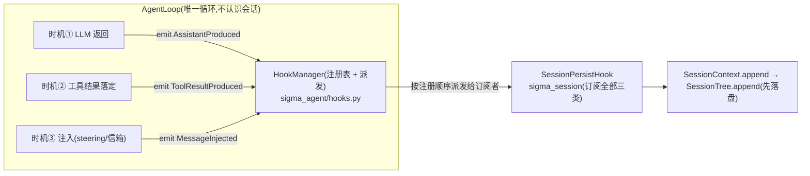

# P4-批次5:钩子管理器(第一期)与会话树增量持久化、断点续跑 详规

> 立项:2026-09-26 ｜ 需求方:星辰 ｜ 状态:**✅ 已落地(2026-09-26。Q1–Q4 均按推荐拍板;G91–G97 全绿)**
> ⚠ **批次6 修订**:事件 `ToolResultProduced` 已并入 `ToolEnd`(加 `message` 字段),observer 通道整体并入钩子——当前事件全集以 `sigma_agent/hooks.py` 与批次6 详规为准。
> 前置阅读:`docs/architecture.md` 3.1(`hooks.py` 预留位)、4.3(hooks 伪代码)、P3-批次1 详规(L1/L2)

## 0. 需求原话(星辰,2026-09-26,三条合并)

> 1. 当前项目会话树 trace 增量发生在每一轮 loop 结束之后,粒度不够;将 SessionContext 的增量信息在**每一次 LLM 返回**以及**每一次 tool 结果返回**时都写入 session_tree——这样即使当前会话中断,下一次也能继续从中断处 loop 继续执行。
> 2. 引入**钩子点、钩子管理器**,所有时机的触发统一使用钩子来管理;在不改变架构的前提下,将部分 API 触发作为钩子加到钩子注册表里面。
> 3. **钩子点是一个触发时机,由事件驱动。**

一句话:**时机 = 事件,loop 只管发事件;持久化从"send 末尾的一次 API 调用"降格为"订阅事件的一个钩子"。**

## 1. 现状与差距(代码坐标)

| # | 现状 | 坐标 |
| --- | --- | --- |
| 1 | loop 无状态:产出先攒局部 `produced`,随 `TurnResult.messages` 一次性返回 | `sigma_agent/loop.py:202` |
| 2 | 会话追加发生在 `run_turn` **整体返回后**:`self._context.append(*result.messages)` | `sigma/sdk.py:693` |
| 3 | 树本身已是**写穿**(append 先落盘再改内存),粒度=调用粒度 | `sigma_session/tree.py:281` |
| 4 | 钩子体系只在架构文档里:目录树预留 `hooks.py # 钩子总线(BaseHook ABC)`,P3-批次2(HookManager + L3)标记 ⬜ | `architecture.md` 3.1 / 9 节 |

差距不在树/存储,**在调用方追加的时机**:`run_turn` 内部有 N 轮 × (LLM 返回 + M 个工具结果),崩在任何中间点,本次 send 的全部产出都丢。后果:

1. 崩前已执行的写工具在磁盘上发生了、树上没有记录 → **审计链断**;
2. LLM 已产出的回答随崩溃丢失,续跑要重新花钱问一遍;
3. "断点续跑"不存在:恢复会话只能从 send 重来。

另有一个续跑硬伤:树上若停在"assistant 带 tool_calls 但结果缺失",直接续跑会把不完整序列发给 provider(OpenAI 协议要求每个 tool_call 后跟 tool 结果)→ 400。

## 2. 方案总览

三部分,互相独立可分步验收:

### 2.1 事件与钩子总线(`sigma_agent/hooks.py`,新文件)

- **事件 = 时机**。事件类型(frozen BaseModel,承载 agent 层消息):

| 事件(钩子点) | 触发时机 | 载荷 |
| --- | --- | --- |
| `AssistantProduced` | **每一次 LLM 返回**(含错误轮的 partial——审计口径与现状一致) | `message: AssistantMessage` |
| `ToolResultProduced` | **每一个工具结果落定**(含 unparsed 合成的失败结果) | `message: ToolResultAgentMessage` |
| `MessageInjected` | steering 提醒 / 信箱回报注入 `produced` 时(信箱是 drain-once,不落盘即真丢) | `message: AgentMessage` |

- **`BaseHook(ABC)`**:`events()` 声明订阅的事件类型 + `on_event(event)` 处理器(两者 abstract)。
  架构 4.1 "抽象方法不得提供默认实现"是针对 Provider/Tool 的("忘实现=坏");钩子是**多点可选订阅**,"不订阅某时机"是语义正确的默认,故两方法都必须显式实现、不设默认——与 a2 判据不冲突,理由随代码写明。
- **`HookManager`**:`register(hook)`(重名拒绝,与 `ToolRegistry` 同判据)+ `emit(event)`(async,按**注册顺序**派发给订阅者;handler 同步/异步都支持——`await` 若返回 awaitable。异步位留给 P3-批次2 的审批类钩子,本期内置钩子全是同步)。
- **零钩子 = 行为与今天逐字节一致**(observer 同款承诺)。loop 新增可选参数 `hooks: HookManager | None = None`,`None` = 不派发。

### 2.2 loop 接线:`produced.append` 收口为"追加 + 发事件"

`run_turn` 内所有 `produced.append(x)` 收口到一个私有方法:先追加进 `produced`,再 `emit` 对应事件。**只发事件,不做别的**——loop 不认识会话、不认识持久化(分层不变:`sigma_agent` 依旧不 import `sigma_session`,lint-imports 三契约不动)。

关键次序:`AssistantProduced` 在 `error_summary` 判断**之前**发出——错误轮的 partial 内容也先落盘再定性("留下审计"与"如实报错"都要,现状口径)。

### 2.3 持久化降格为钩子(`SessionPersistHook`,放 `sigma_session`)

- 订阅全部三类事件,`on_event` = `context.append(event.message)`。放 sigma_session 的理由:它消费 `SessionContext`,而 `sigma_session → sigma_agent` 是允许的依赖方向;产品壳只负责 `register`。
- `InteractiveSession` 组装时注册它;`send()` **删掉**末尾的 `self._context.append(*result.messages)`(否则双重追加)。`TurnResult.messages` 契约不变——CLI 渲染(cli.py:354)与评测(runner.py:188、task_runner.py)只读消费,不受影响。
- 不变量:**树上节点序 == produced 序 == 事件发出序**,树与 TurnResult 可互为对账。

### 2.4 断点续跑:悬空 tool_call 修复(`sigma_session` 纯函数)

- `repair_dangling_tool_results(tree, *, clock) -> list[str]`:沿 head 分支找"assistant 的 `tool_call_id` 在其后没有对应 tool_result 节点"的悬空 id,为每个**合成**一条 `ToolResultAgentMessage(is_error=True, 文案="harness 在该工具执行完成前中断;结果未知,如仍需要请重新调用", details={"repaired": True})` 并 append 进树(持久化、可审计)。
- 挂接点:`InteractiveSession.__init__` 收到 store 支持的 tree 时自动执行(参数 `repair_dangling=True` 可关)。CLI 两条接续路径(cli.py:419 一次性 `--continue`、cli.py:810 REPL `/sessions` 切换)被同一不变量覆盖:**InteractiveSession 拿到的树永远没有悬空 tool_call**。
- 幂等:修复节点落盘后悬空即消失,二次续跑不会重复修。

## 3. 架构对齐声明(不改变架构)

| 约束 | 本批做法 |
| --- | --- |
| 五层依赖单向 | `hooks.py` 在 sigma_agent(只依赖 sigma_ai 消息类型);`SessionPersistHook` 在 sigma_session(向下一格 import,允许);注册动作在产品壳。**零新增跨层 import** |
| 架构 3.1 预留位 | `hooks.py # 钩子总线(BaseHook ABC)` 正式落地,文件名/职责与预留一致 |
| P3-批次2 范围 | 本批交付其 **HookManager 骨架**;L3 危险命令规则、`before_tool_call` 审批、`transform_context`、`should_stop_after_turn` 等其余钩子点**不做**,后续批次在同一注册表上追加注册即可(见 Q4) |
| observer(observe.py) | **不合并**。observer 是旁听(只读渲染),钩子是行为扩展点(可落盘/将来可拦截)——两个正交面,合并会让 CLI 渲染依赖钩子注册状态 |
| 确定性回放 | FakeProvider 路径下事件次序完全确定,回放逐字节一致的门禁不松动 |

## 4. 关键决策点(需要拍板)

| # | 问题 | 推荐 | 备选 |
| --- | --- | --- | --- |
| Q1 | 工具结果落盘粒度 | **B1:批次执行完、按调用序逐条落盘**——树序确定(确定性回放纪律);崩溃窗口=一个批次执行期,批内已完成但未落盘的结果由续跑合成"中断"结果,写工具重做的风险由 L2 checkpoint 兜底 | B2:每个结果完成即落盘(as_completed)——窗口最小,但树上结果序=完成序,与确定性纪律相抵 |
| Q2 | 钩子 handler 抛异常 | **向上传播、中止本轮**——持久化失败还继续跑=审计链分叉(宁可崩,不要错);树是 disk-first,抛出点内存与磁盘一致 | 隔离降级(记 warning 继续)——反对:静默丢审计 |
| Q3 | 悬空工具的恢复策略 | **合成 is_error 结果,重跑与否交模型决定**——自动重跑写工具可能双写 | 只读工具自动重跑(复杂度高、收益小) |
| Q4 | 钩子点范围 | **本批只落 3 个持久化所需钩子点**,架构预留的 before/after_tool_call 等留 P3-批次2 依次注册 | 本批把预留钩子点全部落成空派发位(纯透传) |

## 5. 改动清单

| 文件 | 改动 |
| --- | --- |
| `core/sigma_agent/hooks.py` | **新文件**:`HookEvent` 三模型 + `BaseHook(ABC)` + `HookManager` |
| `core/sigma_agent/loop.py` | 构造参数加 `hooks`;`produced.append` 收口 `_record()`;三个时机 emit;docstring 更新 |
| `core/sigma_session/persist_hook.py` | **新文件**:`SessionPersistHook`(订阅三类事件 → `context.append`) |
| `core/sigma_session/tree.py`(或独立 repair.py) | `repair_dangling_tool_results` 纯函数 |
| `core/sigma/sdk.py` | 组装 HookManager + 注册持久化钩子;`send()` 删末尾批量 append;构造时悬空修复 |
| `tests/` | 下节新测试 |

不动:`store.py`(写穿已满足)、`convert_to_llm`、`compact.py`、evals 运行器、`TurnResult` 契约、observer。

## 6. 测试与门槛(每条都能被证伪)

| 编号 | 断言 | 注入(怎么变红) |
| --- | --- | --- |
| G91 | LLM 返回即持久化:工具执行时树上已有本轮 assistant 节点(靶工具在 run 内查树) | emit 挪回 turn 末 → 红 |
| G92 | 每个工具结果独立节点、独立落盘 | 改回批量 append → 红 |
| G93 | steering/信箱消息注入即落盘(信箱 drain-once 不许丢) | 删该处 emit → 红 |
| G94 | 不双重追加:send 后树节点数 == 事件数 | 恢复 send() 末尾 append → 红 |
| G95 | 悬空修复:构造 assistant(a,b)+result(a) 的 JSONL,续跑后 b 有合成 is_error 结果,且下一轮请求体 a/b 都有 tool_result | 删 repair 调用 → 红 |
| G96 | 修复幂等:二次加载零新增 | — |
| G97 | HookManager:重名拒绝;未订阅的事件不派发;零钩子时与现状逐字节一致 | — |
| 回归 | 回放 6 场景逐字节一致、G35 跨轮累积、task/todo/skill 既有用例全绿 | — |

三道门禁照常:`lint-imports` · `mypy --strict` · `pytest`(全部无 API key)。

## 7. 风险

| # | 风险 | 处置 |
| --- | --- | --- |
| R1 | 双重追加回归 | send() 删 append 与加钩子同一提交;G94 钉住 |
| R2 | 批内中断后模型重发写工具 → 双写 | 中断合成结果文案写明"结果未知";L2 checkpoint 本就是这层的兜底(可 `--rollback`) |
| R3 | 错误轮 partial assistant 落盘 | 与现状"error 轮 messages 也返回"口径一致,非新行为 |
| R4 | 逐事件 async emit 引入新的取消点 | 每次落盘本身仍原子(disk-first);取消只会落在事件之间,语义=中断 |
| R5 | Ctrl-C(SIGINT)场景 | asyncio 取消落在 await 点;已完成事件的落盘保留,未完成的形成悬空 → 续跑修复,正好闭环 |

## 8. 明确不做(本期边界)

- 崩溃瞬间正在执行的工具的"半截结果"无法恢复(它本来就没返回);
- 逐行 fsync 掉电级 durable(JSONL 行级 + 坏行跳过已覆盖进程崩溃;另立议题);
- mid-turn 自动压缩(维持 send 边界触发;续跑后动态区变大,下一轮 send 开头自然压);
- L3 危险命令规则、审批流、`transform_context` 等其余钩子点(P3-批次2 后续)。

## 9. 实现记录(2026-09-26)

| 项 | 结果 |
| --- | --- |
| 改动 | `core/sigma_agent/hooks.py`(新,事件三模型 + BaseHook + HookManager)、`core/sigma_agent/loop.py`(构造参数 `hooks` + `record()` 收口三处 emit)、`core/sigma_session/persist_hook.py`(新)、`core/sigma_session/repair.py`(新)、`core/sigma/sdk.py`(注册持久化钩子 + 接续修复 + `send()` 删末尾批量 append) |
| 测试 | `tests/test_hooks_persistence.py` 新增 **12 条**;全套 **650 passed**(改动前 638)、mypy --strict 59 文件零错误、lint-imports 三契约 KEPT、回放 **6/6** |
| 门槛落点 | G91 `test_assistant_persisted_before_tools_run` · G92 `test_each_tool_result_is_its_own_node` + `test_persist_failure_keeps_earlier_results` · G93 `test_mailbox_message_persisted_at_drain` · G94 `test_send_does_not_double_append` · G95 `test_repair_synthesizes_missing_results` · G96 `test_repair_is_idempotent` + `test_healthy_session_is_untouched` · G97 重名/派发过滤/注册序/异步钩子四条 |

**两处与详规正文的偏差,各附理由**:

1. **事件用 frozen dataclass,不是正文 2.1 说的 BaseModel**——与 `observe.py` 的既有判据同源:事件是瞬时通知、不落盘不校验,真正落盘的 `AgentMessage`(BaseModel)在载荷里。落地时认为跟同一代码库里的"事件家族"保持同一种形状,比正文的措辞更对。
2. **事件载荷带的是"进入 produced 的那条 agent 层消息"**(assistant 事件带的是 `LlmMessageWrapper` 而非裸 `AssistantMessage`)——订阅方要的就是"将被追加进历史的那条消息",拆开再包回去会出现两份包装逻辑。

**过程中踩的坑(它本身就是设计生效的证据)**:`test_persist_failure_keeps_earlier_results` 第一版把故障钩子注册在持久化钩子**之后**,结果第二条结果先被持久化、炸的是它后面的钩子——测试当场红,红的原因恰恰是"派发顺序 = 注册顺序"这条语义在正确工作。把故障钩子挪到持久化钩子之前,断言才钉住真正要钉的时机(逐事件落盘 vs 批次末追加)。
