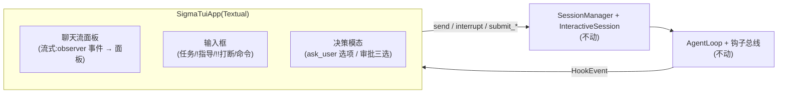

# P5:Textual TUI 重构(交互层)详规

> 立项:2026-09-27 ｜ 需求方:星辰 ｜ 状态:**❌ 已回退(2026-09-27,星辰拍板"回退到 TUI 之前的版本")**
>
> **回退记录**:TUI 落地当日真机暴露布局塌缩(CSS 缺失,已修但体验未达预期),星辰决定放弃 TUI。代码已完整摘除:`core/sigma/tui.py`、`tests/test_tui.py` 删除;`cli.py` 还原为单一行式交互路径(`_run_interactive`,删 `_run_tui`/`_DelegatingApprovalHook`/`--no-tui` 旗标/`ask_target` 晚绑定/`SessionManager.extra_hooks`+`workspace`);pyproject 去 `textual` 依赖;路由测试还原。**TUI 之前落地的批次全部保留**:审批拦截层、ask_user 按键化(_selector)、中途打断与双队列、P0 修复、批次7 影子 checkpoint。本详规作为决策历史保留(下方 §1–§7 为落地当时的记录,含已修复的显示缺陷与布局塌缩分析,供后人重提 TUI 时参考)。
>
> 原状态:✅ 已落地(2026-09-27,拍板=全家桶 + 默认 TUI/行式降级;700 passed)
> 背景:ask_user 按键面板真机截图暴露行式重绘的显示缺陷(已修);星辰提出以 Textual(Python)实现 TUI、重构 CLI 交互、增强体验。

## 0. 需求原话(星辰,2026-09-27)

> 为什么没有显示完全?如果你觉得 cli 难以实现,可以使用 Textual (Python) 实现一个 tui,重构之前的 cli 功能,增强交互体验。

## 1. 显示缺陷的根因(已修,与本批无关但同源)

`_selector._draw_options` 的选项区**行间漏了换行**:`\r\x1b[2K` 只"回到行首+清行",不下移——每个选项把前一个覆盖在同一行,只剩最后一条可见;超宽行折行还会让"光标上移 N 行"错位。已修(逐行换行 + 按终端宽度截断)并加回归测试。**这个缺陷也说明:行式重绘天花板就在这里——每次要"原位更新"都得手搓 ANSI,这正是 Textual 解决的问题。**

## 2. 方案总览

**核心判断:交互层换壳,harness 不动。** `sigma_agent` / `sigma_session` / 钩子 / 持久化 / 审批决策协议全部原样;被替换的只有"人怎么看到、怎么输入"这一层(repl.py 的行式循环)。

### 2.1 界面构成(首版)

| 区 | 内容 | Textual 组件 |
| --- | --- | --- |
| 顶栏 | 会话 id · 模型 · 拦截层状态(L1/L2/L3) | `Header` |
| 聊天流 | 模型流式文本、工具调用(⏺/✓)、steering/排队提示 | `RichLog`(复用渲染钩子的事件形态) |
| 底部 | 输入框 + 快捷键提示 | `Input` + `Footer` |
| 决策模态 | ask_user 选项 / 审批三选:`RadioSet`/`SelectionList`,↑↓ 或 Tab 切换、回车确认——**按键化需求在 Textual 里是原生能力** | `ModalScreen` |

### 2.2 与现有机制的对接点(全部已存在)

1. **流式渲染**:loop 的钩子事件(`TextChunk/ToolStart/ToolEnd/TurnEnd`)经 observer→钩子总线进 TUI(`post_message` 跨线程投递);渲染钩子的行形态语义照搬。
2. **决策模态**:`Chooser` 协议(`标题行, 选项, 推荐 → 下标`)不变——Textual 模态只是 chooser 的第三个实现(按键选择器/编号降级之外)。
3. **打断/双队列**:任务运行中输入框输入 → 同一分类(`!!`/`!text`/裸文本);`Esc` 绑定打断;`session.interrupt()/submit_*` 原样调用。
4. **审批的终端输入**:审批 chooser 在 TUI 里不再读 stdin——弹模态;非 TUI 路径(--no-tui/-p)继续走 `_LineBroker`。

### 2.3 降级与边界

- `sigma -i` 默认起 TUI;`--no-tui` 走现有行式 REPL(保留,服务 CI/脚本/不兼容终端);
- `sigma -p` 一次性模式**完全不变**(管线友好;审批/ask_user 在一次性模式走编号降级);
- 评测与全部既有测试不碰 TUI(它们本来就不渲染);
- 决策模态的键盘交互用 Textual 的 `pilot` 做确定性测试(官方测试机制)。

## 3. 改动清单

| 文件 | 改动 |
| --- | --- |
| `core/sigma/tui.py` | **新文件**:SigmaTuiApp(聊天流/输入框/决策模态/快捷键) |
| `core/sigma/cli.py` | `-i` 分支:无 `--no-tui` → 起 TUI;`--no-tui` 新旗标 |
| `core/sigma/repl.py` | 保留为降级路径(不动或微调) |
| `pyproject.toml` | `textual` 运行期依赖(textual 自带 rich,无新增传递面) |
| `tests/test_tui.py` | pilot 驱动:提交任务/打断/模态选择/命令 |

## 4. 风险

| # | 风险 | 处置 |
| --- | --- | --- |
| R1 | 流式 chunk 高频刷新的性能 | RichLog 按行追加;节流(攒 50ms 批量刷) |
| R2 | Windows 老 conhost 兼容 | Textual 要求 Windows Terminal/较新 conhost;`--no-tui` 兜底,横幅探测提示 |
| R3 | TUI 状态与树状态漂移 | TUI 只消费钩子事件与 SessionManager API,零自有状态 |
| R4 | 批量大 | 拆两步:先最小可用(聊天流+输入+两个模态),增强(会话面板/审批内联)随后续批次 |

## 5. 明确不做(首版)

- 鼠标点击驱动的复杂面板、多标签会话 UI;
- 语法高亮代码块(markdown 渲染)——后续可选;
- 一次性 `-p` 模式的 TUI 化。

## 6. 实现记录(2026-09-27)

| 项 | 结果 |
| --- | --- |
| 显示缺陷(§1) | `_selector._draw_options` 行间漏 `
` → 选项互相覆盖只剩最后一条;已修(逐行换行 + 超宽按终端宽度截断)+ 2 条回归测试(逐行可见 / 截断) |
| TUI 主体 | `core/sigma/tui.py`:`SigmaTuiApp`(Header/聊天流 RichLog/输入框 CommandInput/状态栏/待办面板 TodoPanel/Footer)、`TuiRenderHook`(钩子事件→面板,流式按换行边界缓冲)、`DecisionModal`(OptionList:↑↓/Tab 切换、回车确认、Esc 取消)、`SessionsModal`(/sessions 列表化切换) |
| 打断键 | TUI 内 **Esc**——绑定长在 `CommandInput` 输入框子类上(Input 会吞 Esc,App 级绑定到不了),App 级另有非优先兜底;`Ctrl+Q` 退出 |
| 路由 | `sigma -i` 默认 TUI;`--no-tui` 行式 REPL;`-p` 一次性永远行式(批次 Q2)。审批/ask 经 `_DelegatingApprovalHook`/`ask_target` 晚绑定:TUI → 决策模态,行式 → `_LineBroker` 选择器 |
| 会话/待办 | SessionManager 新增 `workspace` 属性与 `extra_hooks` 参数(渲染钩子随模式可替换);/sessions 面板 + 待办面板数据全部来自既有 API(session_previews / .sigma/todo.json),零自有状态 |
| 依赖 | `textual>=0.40` 进运行期依赖(实测 8.2.8;自带 rich,无新增传递面) |
| 测试 | `tests/test_tui.py` 5 条(pilot 驱动:提交渲染/Esc 打断/模态键盘导航/Esc 取消/follow-up 自动执行);`test_sigma_cli.py` 路由测试 2 条(-i→TUI、--no-tui→行式、TUI 不启动行式读线程);全套 **700 passed**、mypy --strict 62 文件零错误、lint-imports 3 KEPT、回放 **6/6** |

**踩坑记录**:① textual 8.2.8 的 `RichLog.write` 没有 `end=` 与 `style=` 参数(流式改按换行边界缓冲、样式用 rich `Text` 对象);② TUI 模式不能用 monkeypatch `run_repl` 的旧测试——路由已变,测试同步改为断言 `_run_tui` 被调用,并新增"行式降级路由"与"TUI 不启动行式读线程"两条路由门槛;③ Esc 的绑定必须长在输入框子类上(App 级被 Input 吞、模态级会冲突),层次:模态 Esc=取消 → 输入框 Esc=打断 → App 级兜底。

## 7. 实现记录补充:布局塌缩修复(2026-09-27,星辰实测报告)

**症状**:启动后主界面只剩左上角一小块(Header 图标 + 一截输入框),聊天流不可见;
点击左上角弹出的是 Textual 内置命令面板——不是崩溃(底部状态栏与 Footer 均正常)。

**根因(两件,都不是 harness 问题)**:
1. **布局塌缩**:`SigmaTuiApp` 没写任何 CSS。Textual 基类 `Widget` 默认尺寸是
   `auto`,而 `RichLog`/`TodoPanel`(Static)/`Input` 的 DEFAULT_CSS 均不含尺寸
   规则(容器 Horizontal/Vertical 虽默认 1fr,但内容全塌)→ 聊天流 0 行、
   面板内容宽,主区域缩成左上角一角。
2. **"点击弹面板"**:Header 左上角的 `⭘` 图标是 Textual 内置行为
   (`_header.py`:图标点击 → `app.command_palette`),与塌缩无关,只是塌缩
   让人误以为那块小区域就是全部界面。

**修复**:`SigmaTuiApp.CSS` 显式声明全部几何——`#body`/`#chat-column`/`#chat`
1fr 铺满、`#input` 100% 宽、`#todo` 固定 30 列、`#status` 高 1 行贴底;
决策/会话模态居中(`align: center middle`)+ 面板定宽。App 级 CSS 全局生效,
模态一起管。新增门槛 **G118**(`test_layout_regions_fill_screen`):断言渲染后
的**区域几何**(聊天流 ≥10 行/占满列宽、输入框=聊天列宽、状态行高 1 贴底、
决策模态有实际尺寸)——塌缩时"widget 存在"类断言照样绿,几何断言先红。
顺带踩坑:模态推入后要查 `app.screen`(栈顶),App 级 query 只扫默认 screen。

**门禁**:701 passed / mypy --strict 62 文件零错误 / lint-imports 3 KEPT。
