# sigma 设计逻辑（十四图速览）

> 版本 v1.8 ｜ 2026-09-22
> 定位：`docs/architecture.md`（v1.5，1300+ 行）的**单页速览**——只回答"设计逻辑长什么样"，
> 不复述论证过程。任何一处取舍的理由与代价，以 `docs/architecture.md` 与 `docs/decisions/*.md` 为准。
>
> **同步约定**：本文与 `architecture.md` 冲突时以后者为准；`architecture.md` 变更时本文必须同批更新。

---

## 图 1｜分层架构与依赖方向

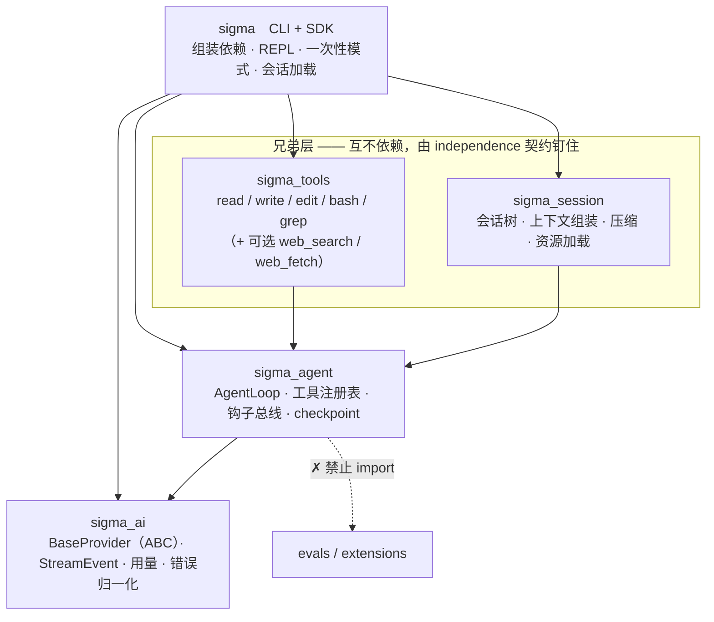

**读图要点**

1. **依赖方向严格单向，由三条契约强制**：`layers`（禁止下层引用上层）+ `forbidden`（core 不得 import
   `evals` / `extensions`）+ `independence`（钉住兄弟层）。
2. **`sigma_tools` 与 `sigma_session` 是兄弟层，不是上下级。** 架构文档里那张竖排图只是排版，
   照它理解会得出"`sigma_tools` 依赖 `sigma_session`"的错误结论。
3. **只写 `layers` 拦不住兄弟依赖**：它是线性栈，语义只有"下层不许引用上层"，
   默认放行所有向下的 import。2026-09-20 实测确认过这个洞（注入 `import sigma_session`
   后两条契约仍然 KEPT、退出码 0），补上 `independence` 之后才能双向拦住。
4. `checkpoint` 放在 `sigma_agent` 而不是 `sigma_tools`：它需要感知"一个工具批次"的边界，
   而这个边界只有 loop 知道。

> 出处：architecture.md 第 3 节 / 第 8 节。契约正文见 `pyproject.toml` 的 `[tool.importlinter]`。

---

## 图 2｜一次 turn 的运行主流程

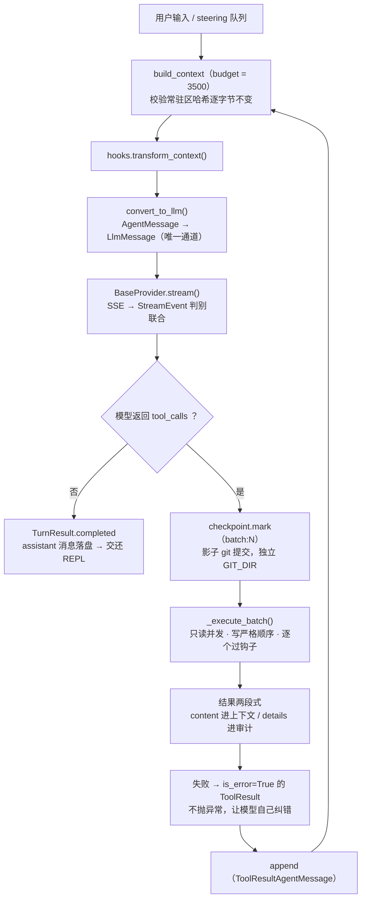

**读图要点**

1. **这是一个薄 loop，全部价值的地基。** 循环体只有四步：组装上下文 → 降级成 LLM 消息 → 流式取回复 →
   有工具调用就执行批次并回到第一步。
2. **`_execute_batch` 的三个必答点**：只读工具并发、写工具严格顺序；每个调用都过钩子（钩子可阻断并给替代结果）；
   单个工具失败**不中断批次**，转成 `is_error=True` 的 `ToolResult`。
3. **工具失败必须是模型可见的信息，不是进程异常。** 这是"agent 能自我纠错"的前提，
   也是评测里"首次成功率 vs 最终成功率"能拉开差距的原因（指标名：纠错增益）。
4. **steering 与 follow-up 的送达时机不同**：steering 在当前 assistant turn 的工具批次执行完后送达
   （打断本批次剩余工具）；follow-up 等 `should_stop_after_turn` 返回 True 之后才送。
5. **checkpoint 在批次之前**：先提交再动手，任何一批写操作都能整体回滚。

> 出处：architecture.md 第 4.3 节。`BaseLoop` 已于 2026-09-20 删除——只允许唯一子类的抽象基类
> 等于给唯一实现加一层纯间接，门槛 G30 改写为"全项目只有一个类定义 `run_turn`"（比原来更强）。

---

## 图 3｜消息两层模型与上下文预算

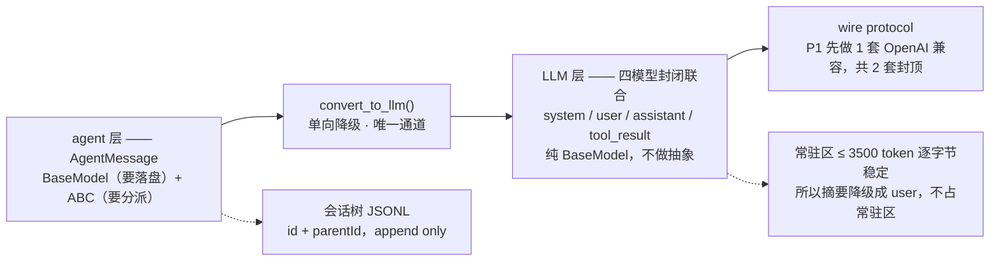

**读图要点**

1. **会话里存的东西 ≠ 发给模型的东西。** 两者之间隔着一个显式单向转换 `convert_to_llm()`；
   于是"存了 UI 专属消息但模型看不见"是免费得到的。
2. **两层的抽象策略相反**：agent 层既有数据（要落盘）又有行为（要降级、要被统一持有）→ `BaseModel + ABC`；
   LLM 层严格对应 wire protocol → 四个纯模型，加基类只会让协议转换更难写。
3. **三个 `*_signature` 字段（`text/thinking/thought`）是不透明串，必须原样回传。**
   漏了会让多轮对话行为异常，且症状完全不指向根因——P1 就要放进类型，哪怕用不到。
4. **压缩摘要降级成 `user`，不是 `system`**：不占常驻区，因而不破坏 prompt cache。
   这是 D4（常驻区 ≤ 3,500 token 且逐字节稳定）能成立的必要前提。
5. **`convert_to_llm` 是自由函数，不是 Context 的方法**：它有三个调用方（常规请求 / 压缩摘要生成 /
   扩展自定义），做成方法会逼后两者构造假 Context。
6. **认不出的类型不静默丢弃**（记录 warning 或抛错）——Python 没有编译期穷尽性检查，
   静默会变成"消息莫名消失"且无从排查。这条与"不允许扩展静默覆盖内置工具"同源：**宁可崩，不要错。**

> 出处：architecture.md 第 4.0 节 / 第 5 节。

---

## 图 4｜自证闭环

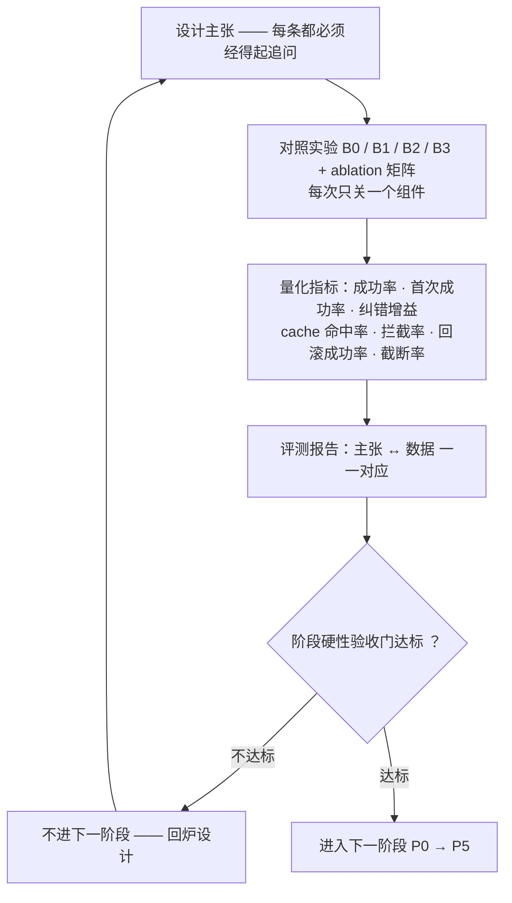

**读图要点**

1. **B1 是整份报告里最关键的一条对照**：有工具、无 harness 干预（满上下文、无压缩、无钩子、无 checkpoint）。
   没有 B1，"harness 有用"就是空论断——因为你不知道收益来自工具，还是来自你的设计。
2. **B 类评测任务的构造顺序是硬性的**：先写测试并验证它在当前代码上失败，**再**写任务描述。
   反过来会造出"自己的实现恰好能过"的任务，评测就失去意义——这是最容易自欺的地方。
3. **对抗类任务不是完成度评测，是边界评测**，只统计拦截率与误拦率，不进成功率指标。
4. **离线可测是分水岭**：`FakeProvider` 回放 transcript，让 agent loop 的回归测试完全不需要 API key、
   完全确定性。一个所有测试都要真跑模型的项目，一定没有回归测试，进而一定会在某个阶段退化。
5. **"每道硬闸都要有注入实验"的机制本身，见图 8**——本条只说"要"，图 8 说"怎么证明要到了"。

> 出处：architecture.md 第 7 节 / 第 9 节。

---

## 图 5｜联网工具组的数据流（批次 7 / 8）

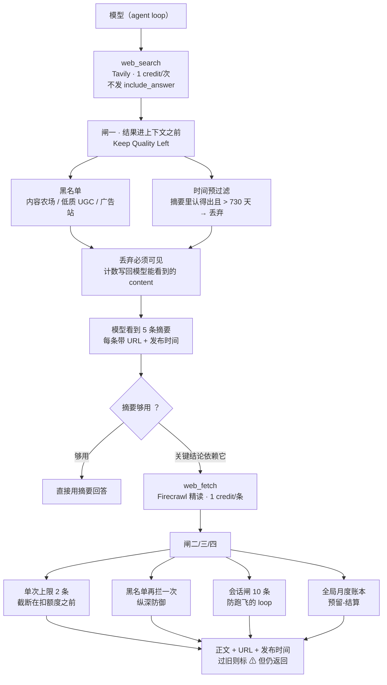

**读图要点**

1. **两张闸位图的区别是"过滤发生在谁之前"。** 闸一在**拼装输出之前**（Keep Quality Left）：
   黑名单与超期结果根本不进上下文，省 token 也省误导。闸二/三/四在**扣额度之前**：
   被截断、被拒绝的 URL 不产生任何成本。
2. **提示词（Guides）+ 代码硬闸（Sensors）必须成对**，单独用任一个都会坏：政策文本提高一次做对的概率，
   硬闸兜住判断失误。分工判据是"需不需要理解"——黑名单、上限、计数**不需要理解**，所以归代码；
   "要不要精读、精读哪条"**需要判断**，所以归模型。
3. **丢弃必须写回 `content`，不是 `details`。** 模型看不见丢弃就会以为"网上资料就这么少"，
   于是不会自我纠正（`details` 是给程序看的，见「结果两段式」）。
4. **过旧正文标注而不丢**：credit 已经花掉，丢掉等于钱花了、信息也没拿到，模型只会再换一条 URL 抓。
   打 ⚠ 让它自己去找更新来源——这条**刻意的偏离**了政策原文的"直接丢弃"。
5. **失败逐条报告，不整批报错。** 报错会让模型重试同一批 URL（同样的 2 条被再抓一次，白花 credit）；
   截断 + 说清"还剩哪几条没取"才会改变它的下一步。这是 `truncate.py` 的同一条教训：文案必须给行动指引。

> 出处：architecture.md 第 2.1 / 5.1 节；完整论证见 `docs/plans/P1-批次8-联网调研与精读-详规.md`
> （政策 12 条 → 落点对照表在 §0，四道硬闸在 §4）。pi 溯源：笔记 13.2（Guides/Sensors）、
> 13.3（计算型 vs 推断型）、13.5（Keep Quality Left）。

---

## 图 6｜文件落点与额度账本的继承（批次 8）

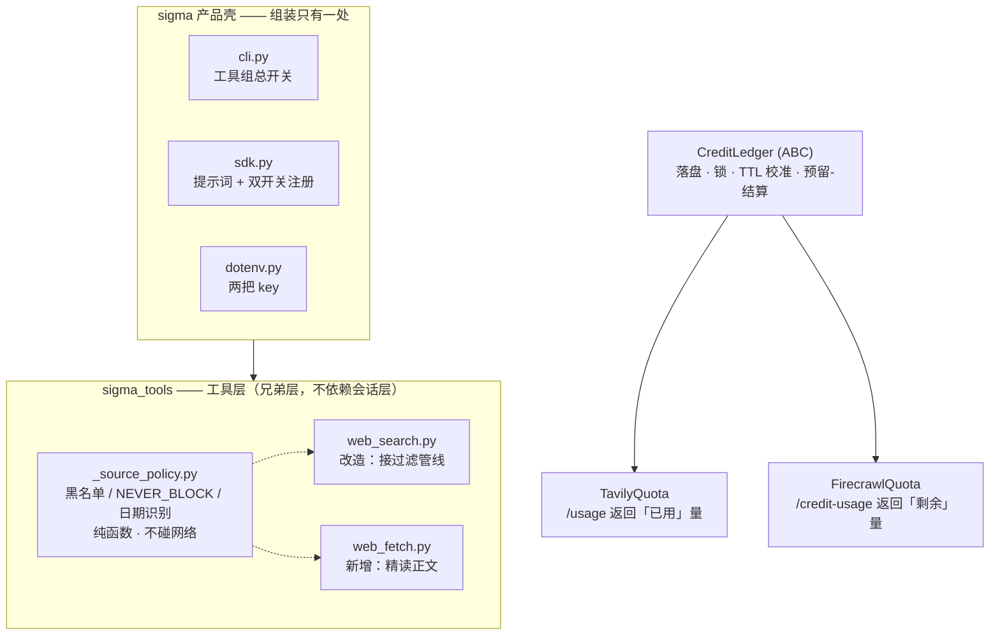

**读图要点**

1. **抽 `CreditLedger` 基类的判据是既有纪律的兑现**：删 `BaseLoop` 时定的是"只有一个子类的抽象基类要删，
   被真实出现的第二个实现所要求的抽象要抽"。批次 8 第二个实现来了，所以抽。
   抽象方法只有两个：`USAGE_PATH`（类属性）与 `_parse_usage`。
2. **两家口径相反，这正是 `_parse_usage` 必须由子类实现、而**不能**写进基类的唯一理由**：
   Tavily 给"已用量"，Firecrawl 给"剩余量"。写反的症状是"额度用了一点就不能用"，
   且**完全不指向根因**——所以两个子类各有一个专门的解析用例钉住换算方向。
3. **三个新增的 `_*.py` 都是工具层内部件**，不认识 `sigma` / `sigma_session`；
   密钥与状态文件路径由 `sigma.sdk` 注入构造函数，**工具层不自己去 `Path.home()` 猜**。
4. **预留-结算的立场是"漏记是越界，多记只是保守"**：成功即已记；401/429/4xx 退回；
   超时 / 5xx / 页面 403·404 **不退**（官方计费表写明这类仍可能已计费）。
   本地账本永远落后于服务端时**绝不主动放宽**，漂移交给校准收敛。
5. **两道额度闸防的不是同一件事**：全局月度闸防"这个月用超了"（到顶就禁用，要等下个月）；
   进程内会话闸（10 条）防"**一个跑飞的 loop 在一轮里把整月额度烧掉**"——只靠月度闸的失败姿态太晚也太贵。

> 出处：architecture.md 第 2.1 / 5.1 节（常驻区预算）。实测：常驻区全开 ≈ 2007 token，
> 仍在 D4 的 3 500 上限内（两席可选工具合计吃掉约四分之一余量，再加东西前先跑 7.6 的 ablation）。
> `is_error` 口径在两个联网工具间**刻意不同**：`web_search` 整次失败即 error；`web_fetch` 逐条报告，
> error 只留给"调用没执行"（取消）——把 401 / 额度拒绝标成 error 会让评测把正常业务状态误当工具崩溃。

---

## 图 7｜回放场景与评测闭环（P2-1）

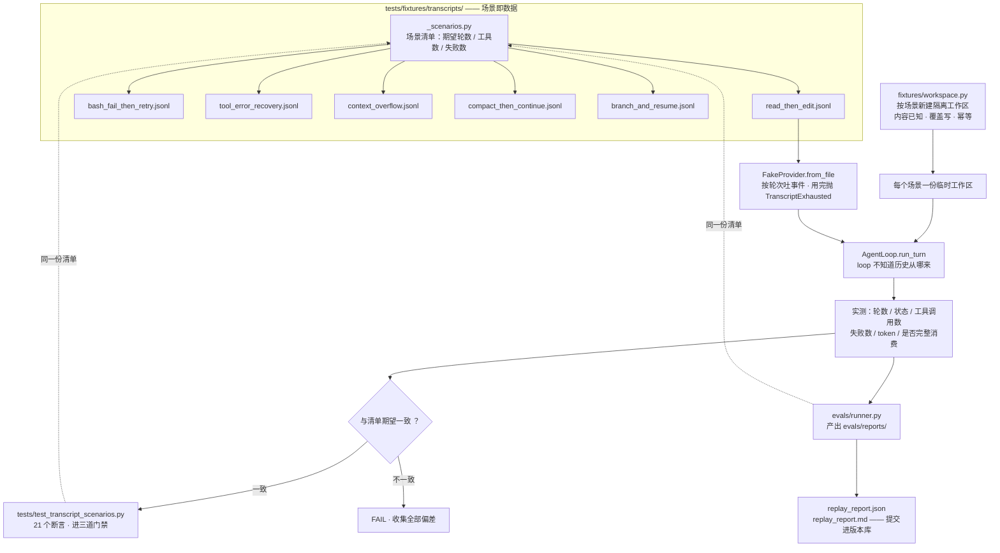

**读图要点**

1. **清单是数据的唯一来源，驱动两条消费路径。** 门禁测试与评测运行器**共用**
   `_scenarios.py` 里的期望值——不各写一份。理由是本项目已踩过的坑：
   两份实现意味着修一个忘另一个（`.venv` 的 `.pth`、loop 的重复 parse 各一次）。
2. **transcript 是 provider 的输入，不是 loop 的输入。** 这是确定性回放能成立的根基：
   把 provider 换成录音，loop 其余部分一行不改。所以图上 `FakeProvider` 与 `AgentLoop`
   是两个独立入边——**P2 引入会话树时，只需在调用处换"历史从哪来"，loop 不动**。
3. **轮次数必须精确匹配，没有宽容空间。** 少一轮 → `TranscriptExhausted`（故意抛错，
   不静默返回空流）；多一轮 → 剩余轮次不被消费。后者尤其危险：状态仍报 `completed`，
   **绿得看不出来**——这正是 G56 门槛（注入"跑完第一轮就收工"必须变红）防的形态。
4. **工作区按场景隔离，且是"新建 + 覆盖写"。** `bash` 工具**有真实副作用**；
   让回放场景对着仓库工作区写，等于让测试去改被测项目本身。
   注意：这份隔离是**好实践但不是门槛**——实测（E56）无法用它证伪任何断言，
   因为场景断言的是 loop 行为、不读文件内容。**证伪不了就不注册为门槛。**
5. **对抗类场景刻意缺席。** `_paths.py` 的 docstring 写明"本模块不是安全边界"（D5）。
   实测：读 `../../../etc/hosts` 的失败原因是"文件不存在"，`rm -rf <不存在路径>`
   返回**执行成功**。写成"必须被拒绝"的断言会**假绿**——绿的原因是路径恰好不存在，
   不是边界生效。那会把"没有防护"伪装成"防护有效"，是本项目定义里最坏的一类测试。
   等 P3 钩子体系落地再加，届时必须能被注入证伪。
6. **这张图第一次画出来时就抓到过一个真缺陷。** 要填"每任务 token"这一列，
   才发现 `TurnResult.usage` 写的是 `total_usage = assistant.usage`——
   **变量名叫 total，装的却是最后一轮**。它不报错、类型也对，
   全套测试没有一条断言看过 `result.usage`，所以一直没被发现。
   修法是逐轮累加（三个字段都要加，`cached_tokens` 漏了同样不报错），
   并用 G58 钉住。**这正是"把数据画出来"的价值：图会逼你去看那些没人看过的字段。**

> 出处：architecture.md 第 7.2 节（确定性回放）/ 7.5 节（指标）；`evals/README.md`（数据集与基线约定）；
> 场景清单与期望值见 `tests/fixtures/transcripts/_scenarios.py`；
> 门槛 G55–G56、G58 的注入实验见 `scripts/gate_injection_p21.py`（4/4 可证伪）。

---

## 图 8｜门槛注入实验：反证「约束真的生效」

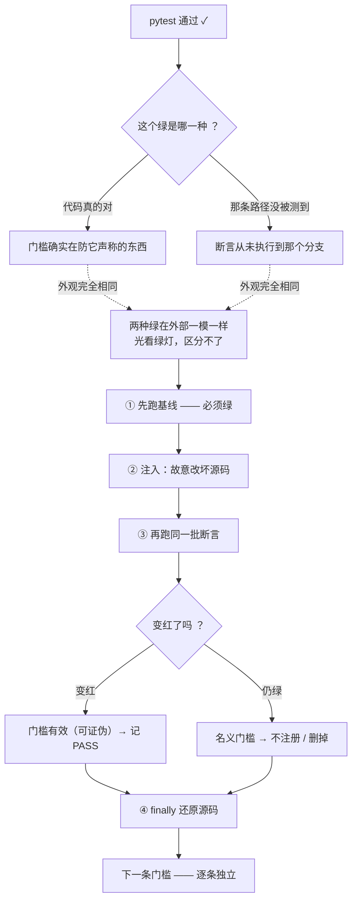

**读图要点**

1. **注入测试测的不是"sigma 会不会被攻击"，而是"门槛是不是真的在起作用"。**
   它是**反向验证**：不证明代码对，而是证明**破坏它会让测试红**。
   被注入的是**你自己的源码**，不是给程序的输入——这也是它和"安全测试"的根本区别。
2. **两条硬条件缺一不可，少哪条证据都作废。**
   少了「基线绿」→ "注入后红"可能只是环境本来就红（本机沙箱的 `BULK_CONFIRM_REQUIRED`
   就制造过这类假象，脚本如实报"基线不是绿的，实验无效"而不是当成功）；
   少了「注入红」→ 门槛没在防它声称的东西。
3. **「仍绿」不是失败，是有价值的发现。** P2-1 的 G57（回放工作区隔离）注入后仍全绿
   → 判定它**证伪不了** → **不注册为门槛**。隔离仍是好实践，但"好实践"和"门槛"是两回事。
   **宁可少一条门槛，不要一条名义门槛。**
4. **ruff 就是这个形态的代价。** 它曾被写进 `P1-批次1.5-详规` 的 G19 当成门槛，
   **却从未进过 CI**——"声明的门槛"大于"实际执行的门槛"。最后是删掉，不是补上。
5. **④ 还原不是礼貌，是正确性前提。** 不还原，下一次实验的基线就是脏的，整条证据链作废。
   所以还原放 `finally`，且脚本必须"响亮地失败"（锚点不中直接抛，不静默跳过）。
6. **锚点与源码硬耦合 → 换代码必须重跑注入（元纪律②）。**
   反过来说，注入脚本读起来像"一堆写死的字符串"是**正常的**：
   它的价值恰恰来自"源码变了它就报错"。P2-1 改 `loop.py` 加了 `_add_usage`，
   就必须把 batch1–batch8 全部重跑一遍——这一步不能省。

> 出处：architecture.md 第 7.6 节（八项主张对照表）；
> `P1-批次1-详规.md` 第 10.4 节（三次"注入做了但测试仍绿"的记录）；
> `P1-批次2-4-详规.md`（E20–E29）；实现见 `scripts/gate_injection_*.py`（合计 49/49 可证伪）。
> 本次会话中它抓到的真实案例：G58 的 `TurnResult.usage` 未累加（见 §图 7 要点 6）。

---

## 图 9｜会话树：分支、回滚与 `path_to` 的分支隔离（P2-2）

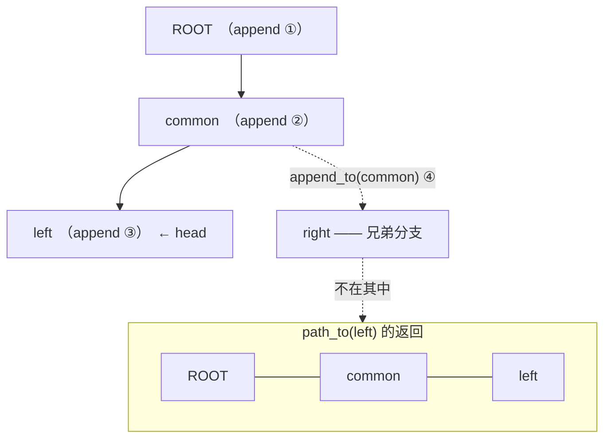

**读图要点**

1. **树只加了一列 `parent_id`，却拿到了分支与回滚。** 架构 2.1 说这是
   "性价比最高的单项设计"——分支 = `append_to(某个较早的节点)`，
   回滚 = `set_head(某个祖先)`。两件事都不需要新数据结构。
2. **`path_to` 只含本分支，不含兄弟（G48）。** 含了兄弟的症状是
   "模型提到了我没说过的事"——在长会话里极难定位。注入实验把它改成
   "返回全部节点"后，分支测试立刻变红。
3. **`append` 默认接在当前 `head` 上，不是变成新根。** 这是本模块最容易写错的一处：
   若默认 `parent_id=None`，每条消息都是孤立根，`path_to` 只返回长度 1 的历史
   ——症状是"模型看不到之前说过的话"，**而且不报任何错**。
4. **落盘顺序是"先写盘、再改内存"。** 于是内存里的树**永远不领先于磁盘**：
   崩在中间只丢一条尚未完成的操作，不会留下"内存以为写了、盘上没有"的状态。
5. **`path_to` 返回的是 id 而不是消息。** 计划 Q2 的原话是"返回根到该节点的消息列表"，
   实现时收窄成 id：分支（`append_to`）与回滚（`set_head`）都要 id，
   要消息另有 `messages_to`。**把两种需求塞进一个返回值，调用方就总要拆一半丢掉。**

> 出处：architecture.md 2.1（一份文档 + 一列 parentId）/ 3.1；
> `docs/plans/P2-会话树与上下文-详规.md` Q1 / Q2；
> 门槛 G48 的注入见 `scripts/gate_injection_batch9.py`。

---

## 图 10｜会话树的两类结构损坏（环 / 断链）

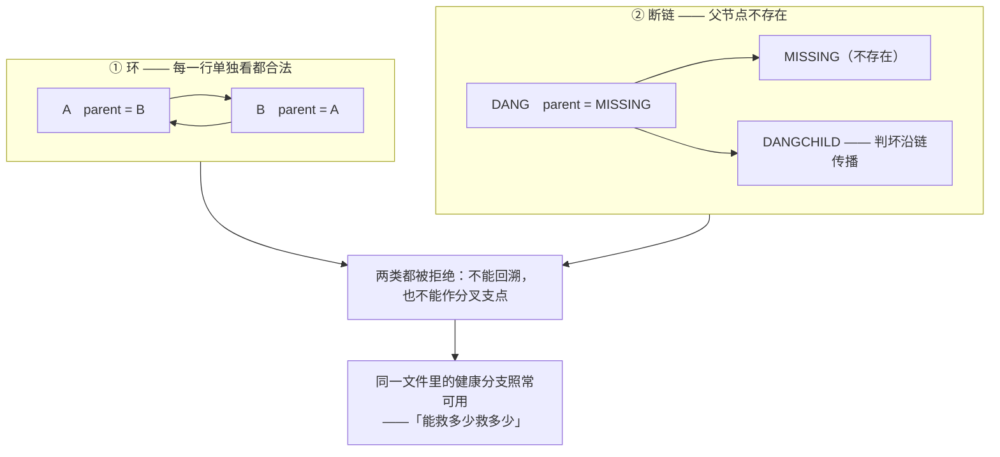

**读图要点**

1. **这两类损坏**不归 `store.py` 管。存储层只做**行级**解析；
   而"`parent_id` 指向不存在的节点"这类损坏，**每一行单看都是合法的**
   ——只有把整个图连起来看才暴露。所以结构化检查（`detect_corruption`）
   落在 `tree.py`，加载后跑一次，产出一份"哪些节点坏了、为什么"的报告。
2. **`store` 的"坏行跳过"与这里的"结构判坏"是两层，不要混。** 前者是
   *这行没法解析*（数据没了）；后者是*这行能解析但放不进树*（语义不成立）。
   处置也不同：前者靠 warning + 行号，后者靠 `corrupt_nodes()` 报告 + 拒绝使用。
3. **`path_to` 有两条防线，这不是冗余。** 防线一（`seen` 集合）给出**具体的环链**
   `A -> B -> A`，诊断信息本身有价值；防线二（步数上限 = 节点总数 + 1）
   保证"即便防线一被写坏，进程也不会挂死"。**挂死的 CI 比失败的 CI 难排查得多。**
4. **G49 必须断言"具体链条"，不能只断言"节点被判坏"。** 因为防线二会在
   防线一失效时兜住结果，于是"节点坏了"这条断言**依然会绿**——
   一条假绿。**兜底不等于正确**，这条门槛就是为这句话设的。
5. **损坏沿父子链传播**：祖先的来历不明，后代的历史必然也是残缺的。
   把断链节点"当成新的根"看起来更宽容，实际会让模型看到一段
   **凭空开始的历史**——静默的错误比明确的拒绝更坏。

> 出处：`P2-会话树与上下文-详规.md` Q1（坏行处置）/ Q2（环检测）/ R2.6；
> 门槛 G49 的注入见 `scripts/gate_injection_batch9.py`（关掉 `seen` 诊断后必红）。

---

## 图 11｜常驻区预算与两道断言（P2-3）

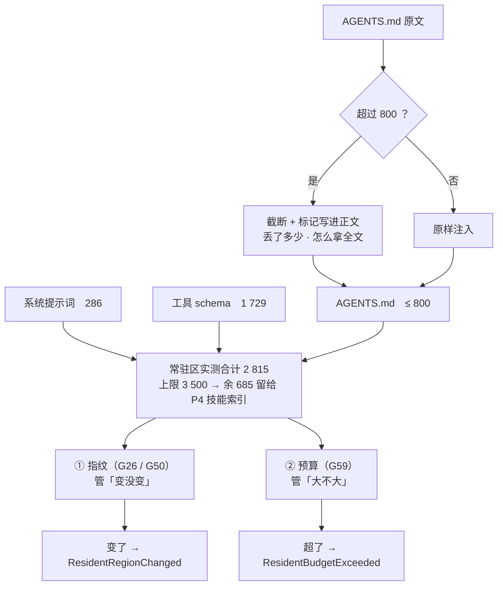

**读图要点**

1. **常驻区的定义只有四项**（D4 原文：系统提示词 + 工具 schema + **项目说明** +
   技能索引），**摘要不在里面**——它降级成 `user` 追加到尾部，属动态区。
2. **这张图第一次画的时候，纠正了我自己一个算错的口径。** P2 详规 Q5 当时算出
   "常驻区 ≈5,107、超 1,600+"，是把**摘要**（1,000）与**技能索引**（600）
   都加进了常驻区——**重复计算**。按 D4 的定义实测是 `286 + 1 729 + 1 500 = 3 515`，
   **超 15**。**这个差别很大**：说"超 1,600"会让人以为 D4 已经不可维持，
   于是下一次倾向于继续放宽它。
3. **收到 800 的理由也因此换了**：不是"现在快爆了"，而是
   **给 P4 的技能索引留空间**（`2 815 + 600 = 3 415 ≤ 3 500`）。
   维持 1,500 的话，P4 一加技能索引就是 `3 515 + 600 = 4 115`。
   **理由要说准——说错方向会让后来者做错决定。**
4. **两道断言管两件不同的事，不是同一件事的两半**：
   指纹管"变没变"（变了 prompt cache 全失效，静默、只是变慢变贵），
   预算管"大不大"（超了每轮都多付，同样静默）。所以各有一条门槛、
   各有一个能证伪它的注入实验。
5. **`AGENTS.md` 是常驻区里唯一"长度由用户决定"的项**，所以它是最脆弱的一环——
   用户写一篇长文就能顶爆预算。硬截断是必须的，而**截断本身要能被模型看见**：
   标记写在正文里、说清丢了多少、并给出 `read` 全文的指引。
6. **标记分长短两档**，且 `_compose_truncated` 从长到短试以**保证不超预算**。
   这不是过度设计——参数化扫多档上限的测试抓出过一个真缺陷：
   详细标记本身约 60 token，上限配 50 时"先切正文再拼标记"会产出 **61 token**，
   **标记自己撑破了预算**。

> 出处：architecture.md D4 / 5.1（含 2026-09-21 的口径更正与实测表）/ 5.2；
> `P2-会话树与上下文-详规.md` Q5（原文口径有误，已更正）；
> 门槛 G50+ / G54 / G59 的注入见 `scripts/gate_injection_batch10.py`（4/4 可证伪）。

---

## 图 12｜压缩：不改历史，只改发给模型的那份（P2-4）

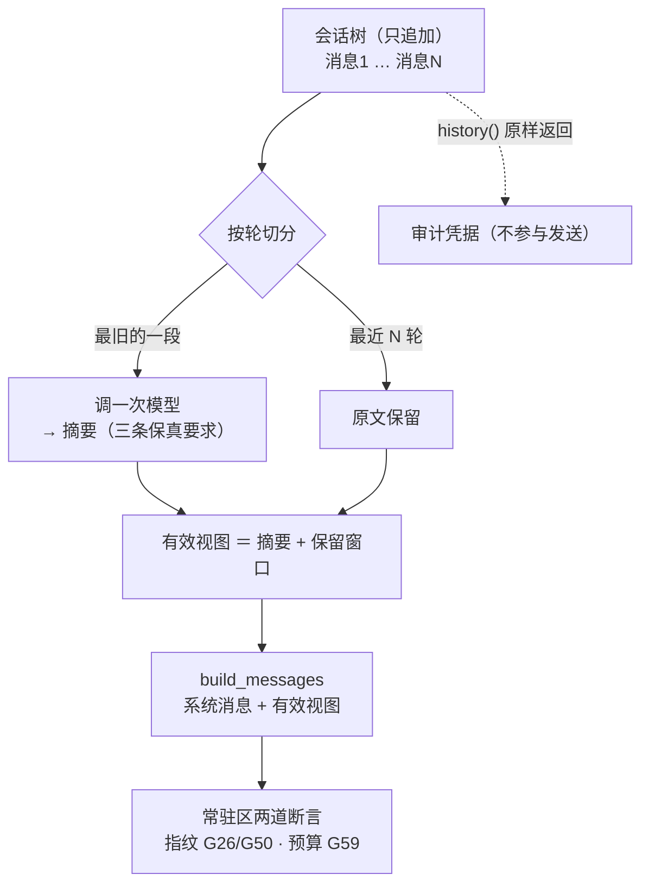

**读图要点**

1. **压缩不改历史，只改"发给模型的那份"。** 这是本项目对 P2 详规 Q3 的**有意偏离**：
   Q3 说"把最旧的一段**替换**掉"，而 P2-2 之后历史住在只追加的会话树里，
   "替换前缀"要么改写节点、要么重新挂父——**两者都等于改写历史**。
   代价不是"实现麻烦"，而是 `store.py` 里写死的那条：
   "会话历史是事实记录，改写它会让「这条消息当时是否存在过」变得不可考"。
   所以压缩产出的是**派生视图**，树里原文一个字节不动（G60 钉住）。
2. **"一轮"的边界是 `user` 消息，不是 `assistant`。** 一轮里模型可能调多次工具
   （assistant → tool_result → assistant → …）。按 assistant 切会把同一轮切成好几段，
   于是"保留最近 3 轮"实际只保留了 3 次模型调用——
   **症状是"保留得比预期少"，而看起来又像是对的。**
3. **G51 其实是两件独立的事，P2 详规的预判在这里错了。**
   原预判是"把摘要改成 `system` → 常驻区哈希变化（G50 连带红）"。
   实测**不成立**：指纹是从 `_resident_text()` 与工具 schema 算的，**与历史无关**。
   真正独立的两层是——**类型层**（降级成什么，错在"模型把历史摘要当系统指令"）
   与**位置层**（在不在常驻区，错在"每压一次 prompt cache 全失效"）。
   所以拆成两条注入分别证伪。**预判错得有价值**：它说明这条门槛原本只被想成了一条。
4. **三条保真要求（G52）**：任务目标 / 已经改过哪些文件 / 失败过什么。
   第三条最容易漏，而漏了的症状是 agent **重复踩已经踩过的坑**——
   看起来像"模型不够聪明"，离根因（提示词少一条）非常远。
5. **触发点定在 80%**，理由是**压缩本身要花一次调用**：等到上下文满了再压，
   可能连"把要压的内容发出去"都做不到。**触发点必须留出一次调用的余量。**
6. **`keep_from` 存节点 id 而不是下标**：下标会在压缩之后继续追加消息时漂移，
   而 id 稳定。这不是"更优雅"，是"下标会错"。
7. **压缩成本记进 `details`（R2.4）**：漏记会让"每任务 token"**系统性偏低**——
   长会话越省越显得划算，而省下来的正是没被记账的那次调用。

> 出处：architecture.md 5.2 / D4（摘要不占常驻区）；
> `P2-会话树与上下文-详规.md` Q3（原文说"替换"，实现按视图，理由见上）；
> 门槛 G51 / G52 / G60 的注入见 `scripts/gate_injection_batch11.py`（4/4 可证伪）。

---

## 图 13｜会话接续：四种情形，一种都不能静默（P2-5）

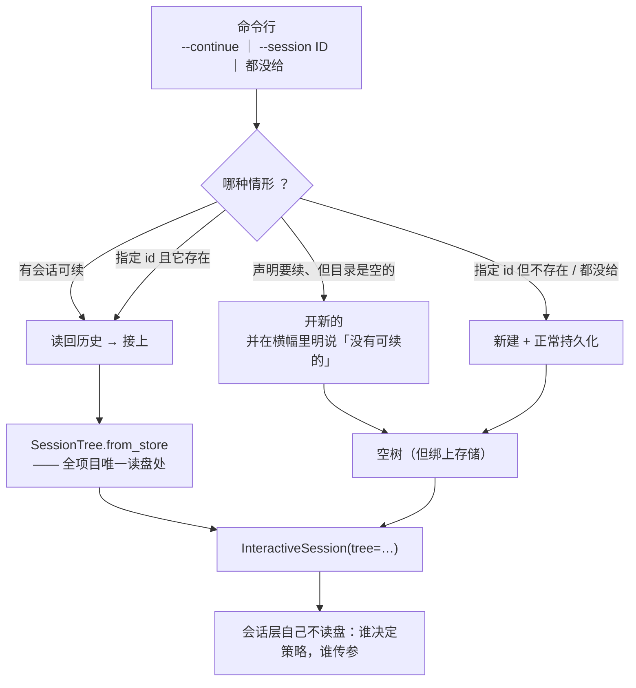

**读图要点**

1. **「声明要续、但没东西可续」必须说出来。** 静默开一个新会话是最坏的处置：
   用户以为自己在续上下文，实际拿到一个空白会话，于是模型"忘了"之前的一切
   ——**而它看起来只是"这次回答得不好"**，不像 bug。所以横幅里要明写
   "没有可续的会话，已新建 X"。
2. **读盘只有一处**：`SessionTree.from_store`。CLI 只负责"用哪个 id"，
   SDK 只负责"把树交给上下文"。三处各读一次的话，
   任何一处改了加载语义，另外两处就会悄悄不一致。
3. **会话文件放在用户级配置目录**（`~/.sigma/sessions/`），**不放工作区**。
   放 `<workspace>/.sigma/` 会**污染别人的仓库**——那个项目未必 gitignore 它。
   这条与"工具层不猜密钥路径"是同一条判据（谁决定策略谁传参），
   所以 `store.py` / `sessions.py` 都只接受一个 `root`，由产品壳传 `Path.home()`。
4. **会话 id 与节点 id 的取法刻意不同**：节点 id 用纯 uuid4（多进程下必须不撞）；
   会话 id 是 `20260922-091303-a1b2`——**给人看的**，能一眼看出先后，
   `--continue` 之后用户要知道自己续的是哪个。末尾四位随机防同秒撞。
5. **`--continue` 与 `--session` 互斥**，且在**启动时报错**。
   两者语义冲突（一个说"续最近那个"，一个说"用这个 id"），
   放开就只能靠"谁先赋值"决定行为——**隐式规则迟早会被读错**。
6. **G61 点了两条证据路径**：端到端那条（重启后模型真的看到上一轮的话）
   与解析层那条（`resolve_session` 认出已存在的会话）。
   只注一条的话另一条永远没被检验过——而两层里任何一层坏掉，
   症状都是同一句"模型忘了"。

> 出处：`P2-会话树与上下文-详规.md` Q1（落点 `~/.sigma/sessions/<id>.jsonl`）/ §10 第 5 步；
> 门槛 G61 / G61b / G62 / G63 的注入见 `scripts/gate_injection_batch12.py`（4/4 可证伪）。

---

## 图 14｜技能：索引常驻、正文按需（P4-批次1）

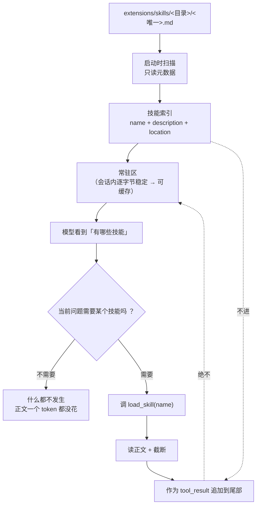

**读图要点**

1. **两条路，一条稳定一条只追加。** 索引走常驻区（会话内不变 → 可缓存），
   正文走尾部（**追加不改变前缀** → 前面整段缓存仍命中）。
2. **这就是「渐进披露不破坏 prompt cache」的答案**，而且是**结构上成立**的，
   不是"声称"。研究笔记第 310 行把这件事标成"Pi 说的、自研时要实测、
   不要默认成立"——本图的前两条给出了它在本项目里成立的理由。
   ⚠️ 但"命中率有没有真上去"是另一回事（受 provider 分段策略影响），
   那条留给对照实验，**这里不宣称**。
3. **反例**：把正文拼进系统提示词 → 每加载一个技能，前缀就变一次 →
   **之前所有缓存白建**。所以架构第 1028 行写着"技能正文**不能**插在常驻区"。
   G76 就是钉这条的（注入 `render_index` 把正文也拼进去 → 必红）。
4. **E64 那条注入同时是架构 7.6 节的 ablation 档位**：
   第 1170 行「技能全量注入 vs 按需」——把正文拼进索引，就是"全量注入"那一档。
   所以那个对照实验在本项目里**是可实现的**，不是理念之争。
5. **索引里的 `location` 是相对路径，根目录只在头部出现一次**：
   每条都带全路径会把预算吃掉约 3 倍，而模型**不需要它来调用**
   （它按名字调），那一栏是给人核对的。
6. **技能目录必须恰好一个 `.md`**：这样 `location` 才有信息量——
   若写死成 `<目录名>.md`，它就只是 `<name>/<name>.md` 的复述，
   一个字的信息都没多。
7. **正文被截断时，「被截断了」这句话自己不能被预算吃掉**（G79）。
   详细标记里带**绝对路径**，而路径长度随环境变——同一个预算，
   一种机器切得下、另一种机器上**标记自己就把预算吃光** → 返回空文本，
   于是模型**既拿不到正文、也看不到「被截断了」**。
   处置是加一条只含**相对**路径的短标记退路：**"丢弃必须可见"这条底线
   不该随机器而变**。

> 出处：`P4-批次1-Skill系统-详规.md`（§2 两条路径 / §3 缓存论证 / §5 索引来源 A/B/C）；
> 门槛 G75–G79 的注入见 `scripts/gate_injection_batch14.py`（5/5 可证伪）；
> 预算实测与 cap 重新分配见 `architecture.md` §5.1.0。

---

## 一道**测不了**的验收门（诚实记下来）

P2 的硬性验收门第 3 条是「**压缩前后回放成功率下降 ≤ 5%**」。它现在**测不了**，
原因不是没时间，而是**原理上离线做不到**：

- 「成功率」要判定"压完之后模型还够不够用"，而这需要**真模型**去理解任务；
- `FakeProvider` 是**回放录音**，它不理解任何东西——拿它算出来的"成功率"
  只是在数"脚本还对得上吗"，**与压缩质量无关**。

所以这条门必须等 `evals/datasets/` 的 70 条任务集落地（需真实 API key）才能跑。
**在那之前它是"未验收"，不是"已通过"。** 这条写在 P2 详规 §14 与 README 的未落地清单里。

离线能做到的、也做了的是："压缩不破坏 loop"——`InteractiveSession` 自动压缩之后
本轮任务照常完成、压缩失败不打断会话、摘要不进常驻区（G51/G51b/G60）。

---

## 当前落地情况（截至 2026-09-22）

| 层 | 已落地 | 未落地（图上仍是设计位） |
| --- | --- | --- |
| `sigma_ai` | `base.py`（BaseProvider ABC）· `messages / events / errors / tokens / tool_calls / registry / fake` · `openai/{protocol,convert,sse,provider}` | `anthropic.py`（P4 之后） |
| `sigma_agent` | `base.py`（BaseTool ABC）· `agent_messages.py` · `loop.py`（AgentLoop）· `registry.py` · `types.py` · `observe.py` · **`checkpoint.py`（影子 git，P3-批次1）** | `hooks.py`（P3-批次2，含 L3 钩子规则）· steering |
| `sigma_session` | `context.py`（常驻区指纹 + 预算 + 树上的历史）· `store.py`（JSONL 落盘）· `tree.py`（分支 / 回滚 / 环与断链检测）· `resources.py`（`AGENTS.md` 读取 + 硬截断）· `compact.py`（压缩：视图式，不改历史）· `sessions.py`（会话目录） | `compact.py`（压缩）——**没有 `base.py`，见下** |
| `sigma_tools` | 核心 5 工具 `read / write / edit / bash / grep` + `truncate / _paths`（**`_paths` 含 L1 写路径约束**）；可选联网组 `web_search`（Tavily，批次 7）/ `web_fetch`（Firecrawl，批次 8）；联网内部件 `_credit_ledger`（基类）· `_tavily_quota` · `_firecrawl_quota` · `_source_policy` | — |
| `sigma` | `cli.py`（含 `--continue` / `--session`）· `sdk.py · repl.py · render.py · dotenv.py` | — |
| `evals` | `runner.py`（最小评测运行器，跑回放场景）+ `tests/fixtures/transcripts/` 六个场景 + `tests/fixtures/workspace.py` 隔离夹具 | `datasets/` 的 70 条任务集（需真实 key + 判定脚本） |

**`sigma_session` 为什么没有 `base.py`（不是遗漏，是决定）**

    架构 3.1 的目录树里写了 ``base.py # BaseStore（ABC）``，但 P2 详规 **Q4 决定不抽它**。
    判据是本项目已固化的那条：**"只有一个子类的抽象基类 = 纯间接，要删；
    被真实出现的第二个实现所要求的抽象才抽"**（删 `BaseLoop`、抽 `CreditLedger`
    是这条判据的两次应用）。

    本阶段只有 JSONL 一个存储实现，所以现在抽 `BaseStore` 就是给唯一实现加一层纯间接。
    等第二个后端（SQLite / 内存测试替身）真的出现再抽——那时是一次 `git mv` + 提取，
    代价几乎为零。**反过来，现在抽了，它会成为一个"只有一个实现"的抽象，
    而这类抽象最容易在后来被当成"支持多后端"的证据。**

**因此**：图 1、图 2 中标注 `hooks.transform_context`、`checkpoint.mark`、
常驻区哈希校验的节点**目前是设计位，不是已有实现**（`SessionTree` 设计位已完成，见图 9/10）；
P0 骨架 + P1 最小闭环已成形态；
**P2-1（回放场景与运行器）已完成**（图 7 对应）；
**P2-2（会话树与存储）已完成**（图 9 / 图 10 对应）；
P2 的压缩与 `AGENTS.md` 注入（图 1 的设计位）尚未开始。

---

## 五条不变式（跨图）

| 不变式 | 含义 | 落点 |
| --- | --- | --- |
| 宁可崩，不要错 | 认不出的消息类型不静默丢弃；扩展不得静默覆盖内置工具；抽象方法不给默认实现；**认不出日期就不丢（不猜）** | 图 3 · 图 5 · CI 门禁 |
| 常驻区逐字节稳定 | 系统提示词 / 工具 schema / `AGENTS.md` / 技能索引在会话内一个字节都不能变；**联网工具关掉时提示词逐字节回到 `SYSTEM_PROMPT`** | 图 2 · 图 3 · 图 6 |
| 唯一通道 | agent 层 → LLM 层只有 `convert_to_llm()` 一个引用点；`sigma_ai` 不认识 `AgentMessage` | 图 1 · 图 3 |
| 单向依赖 | 五层只允许向下；兄弟层互不依赖；core 不碰 `evals` / `extensions` | 图 1 · 图 6 |
| 每个主张都要有数据 | 任何新功能先问"它对应第 7.6 节哪一条主张"，答不出来就不做；**每道硬闸都要有能证伪它的注入实验** | 图 4 · 图 5 · 图 7 · 图 8 |
| 丢弃必须可见 | 被硬规则过滤 / 截断的东西，计数写回模型能看到的 `content`，否则模型以为"世界就这么大" | 图 5 |
| 证伪不了就不是门槛 | 写了断言但没有任何注入能让它变红 = 名义门槛，不如没有（实测例：P2-1 的「工作区隔离」G57 因此未注册） | 图 7 · CI 门禁 |

---

## 变更记录

| 日期 | 版本 | 变更 |
| --- | --- | --- |
| 2026-09-21 | v1.0 | 初版：四图速览（分层 / 运行 / 消息 / 自证）+ 落地对照表 + 五条不变式 |
| 2026-09-21 | v1.1 | 批次 7/8 落地后补**图 5（联网工具组数据流）**与**图 6（文件落点与账本继承）**； |
|  |  | 落地对照表同步 `sigma_tools` 的联网内部件；标题改"六图速览"；基准版本 v1.3 → v1.5 |
| 2026-09-21 | v1.2 | P2-1 落地后补**图 7（回放场景与评测闭环）**；标题改"七图速览"； |
|  |  | 落地对照表加 `evals` 行；不变式加「证伪不了就不是门槛」； |
|  |  | 记录两处**故意不做**：对抗场景（无安全边界，写了会假绿）、G57 工作区隔离（证伪不了）； |
|  |  | 图 7 画的过程**逼出一个 P1 遗留缺陷**：`TurnResult.usage` 没累加（G58 已钉住） |
| 2026-09-21 | v1.3 | 补**图 8（门槛注入实验：反证「约束真的生效」）**；标题改"八图速览"； |
|  |  | 图 4 读图要点加一条指向图 8（"要"在图 4，"怎么证明要到了"在图 8） |
| 2026-09-21 | v1.4 | P2-2 落地后补**图 9（会话树分支/回滚/path_to 隔离）**与**图 10（两类结构损坏）**； |
|  |  | 标题改"十图速览"；落地对照表更新 `sigma_session` 并记明**没做 `base.py` 是决定不是遗漏** |
| 2026-09-21 | v1.5 | P2-3 落地后补**图 11（常驻区预算与两道断言）**；标题改"十一图速览"； |
|  |  | 落地对照表同步 `resources.py`；**图 11 纠正了 Q5 的口径错误**（超 15 而非超 1,607）|
| 2026-09-22 | v1.6 | P2-4 落地后补**图 12（压缩：不改历史，只改发给模型的那份）**；标题改"十二图速览"； |
|  |  | 落地对照表同步 `compact.py`；**图 12 记了 G51 预判被推翻**（类型层与位置层是两件事）|
|  |  | 另加一节「一道**测不了**的验收门」：≤5% 那道压缩成功率门离线做不到，需真模型 |
| 2026-09-22 | v1.7 | P2-5 落地后补**图 13（会话接续：四种情形，一种都不能静默）**；标题改"十三图速览"； |
|  |  | 落地对照表同步 `sessions.py` 与 `cli.py`；另补 `architecture.md` §9.1 **实际进度（时间到分钟）**， |
|  |  | 把此前只记日期的排期校准到提交时刻，并与"P1/P2 各约 3 周"的计划对照（含四条口径说明）|
| 2026-09-22 | v1.8 | P4-批次1 落地后补**图 14（技能：索引常驻、正文按需）**；标题改"十四图速览"； |
|  |  | **记了 5.1 表的分项上限从来没在 3500 里装下过**（旧五条相加 4050）→ 重新分配使和 = 3500 |
