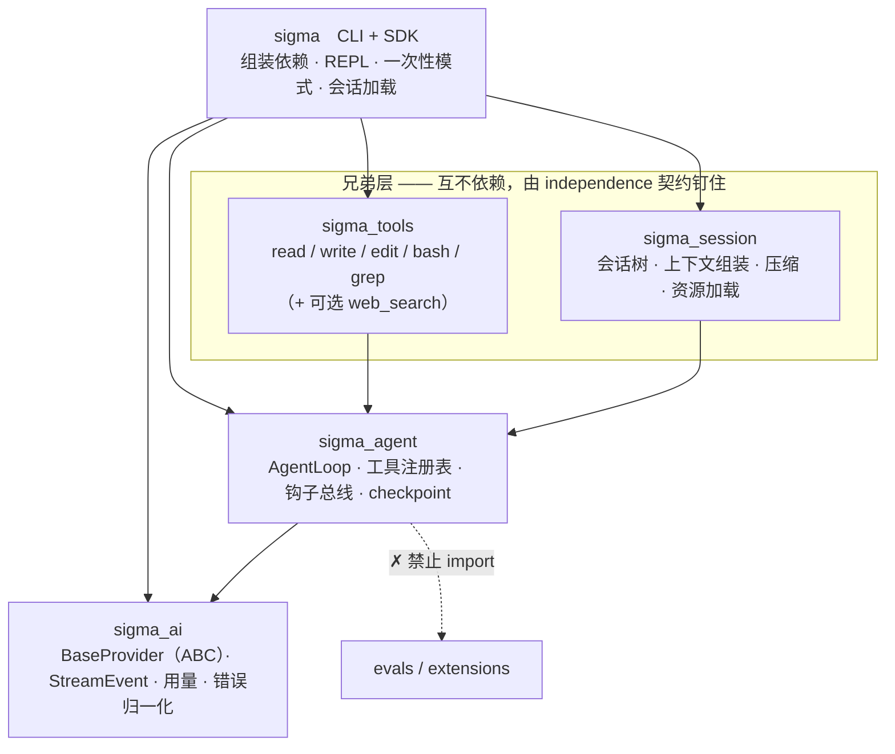
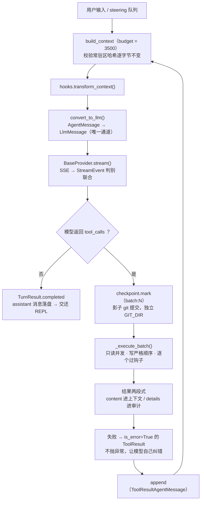
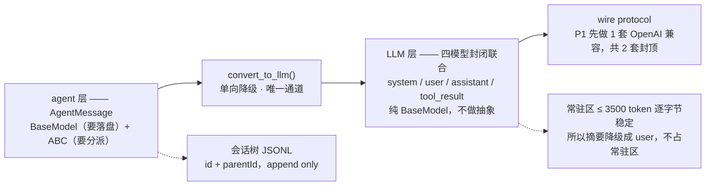
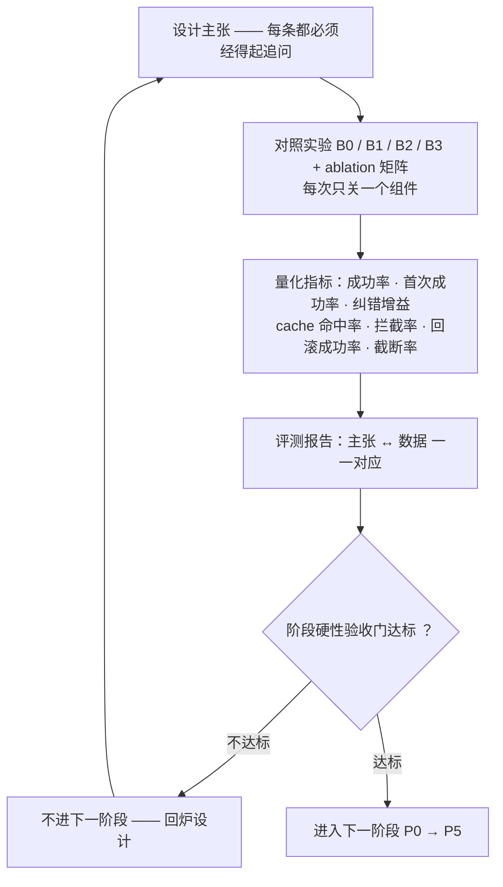

# sigma 设计逻辑（四图速览）

> 版本 v1.0 ｜ 2026-09-21
> 定位：`docs/architecture.md`（v1.3，1212 行）的**单页速览**——只回答"设计逻辑长什么样"，
> 不复述论证过程。任何一处取舍的理由与代价，以 `docs/architecture.md` 与 `docs/decisions/*.md` 为准。
>
> **同步约定**：本文与 `architecture.md` 冲突时以后者为准；`architecture.md` 变更时本文必须同批更新。

---

## 图 1｜分层架构与依赖方向

**读图要点**

1. **依赖方向严格单向，由三条契约强制**：`layers`（禁止下层引用上层）+ `forbidden`（core 不得 import
   `evals` / `extensions`）+ `independence`（钉住兄弟层）。
2. **`sigma_tools` 与 `sigma_session` 是兄弟层，不是上下级。** 架构文档里那张竖排图只是排版，
   照它理解会得出"`sigma_tools` 依赖 `sigma_session`"的错误结论。
3. **只写 `layers` 拦不住兄弟依赖**：它是线性栈，语义只有"下层不许引用上层"，
   默认放行所有向下的 import。2026-09-20 实测确认过这个洞（注入 `import sigma_session`
   后两条契约仍然 KEPT、退出码 0），补上 `independence` 之后才能双向拦住。
4. `checkpoint` 放在 `sigma_agent` 而不是 `sigma_tools`：它需要感知"一个工具批次"的边界，
   而这个边界只有 loop 知道。

> 出处：architecture.md 第 3 节 / 第 8 节。契约正文见 `pyproject.toml` 的 `[tool.importlinter]`。

---

## 图 2｜一次 turn 的运行主流程

**读图要点**

1. **这是一个薄 loop，全部价值的地基。** 循环体只有四步：组装上下文 → 降级成 LLM 消息 → 流式取回复 →
   有工具调用就执行批次并回到第一步。
2. **`_execute_batch` 的三个必答点**：只读工具并发、写工具严格顺序；每个调用都过钩子（钩子可阻断并给替代结果）；
   单个工具失败**不中断批次**，转成 `is_error=True` 的 `ToolResult`。
3. **工具失败必须是模型可见的信息，不是进程异常。** 这是"agent 能自我纠错"的前提，
   也是评测里"首次成功率 vs 最终成功率"能拉开差距的原因（指标名：纠错增益）。
4. **steering 与 follow-up 的送达时机不同**：steering 在当前 assistant turn 的工具批次执行完后送达
   （打断本批次剩余工具）；follow-up 等 `should_stop_after_turn` 返回 True 之后才送。
5. **checkpoint 在批次之前**：先提交再动手，任何一批写操作都能整体回滚。

> 出处：architecture.md 第 4.3 节。`BaseLoop` 已于 2026-09-20 删除——只允许唯一子类的抽象基类
> 等于给唯一实现加一层纯间接，门槛 G30 改写为"全项目只有一个类定义 `run_turn`"（比原来更强）。

---

## 图 3｜消息两层模型与上下文预算

**读图要点**

1. **会话里存的东西 ≠ 发给模型的东西。** 两者之间隔着一个显式单向转换 `convert_to_llm()`；
   于是"存了 UI 专属消息但模型看不见"是免费得到的。
2. **两层的抽象策略相反**：agent 层既有数据（要落盘）又有行为（要降级、要被统一持有）→ `BaseModel + ABC`；
   LLM 层严格对应 wire protocol → 四个纯模型，加基类只会让协议转换更难写。
3. **三个 `*_signature` 字段（`text/thinking/thought`）是不透明串，必须原样回传。**
   漏了会让多轮对话行为异常，且症状完全不指向根因——P1 就要放进类型，哪怕用不到。
4. **压缩摘要降级成 `user`，不是 `system`**：不占常驻区，因而不破坏 prompt cache。
   这是 D4（常驻区 ≤ 3,500 token 且逐字节稳定）能成立的必要前提。
5. **`convert_to_llm` 是自由函数，不是 Context 的方法**：它有三个调用方（常规请求 / 压缩摘要生成 /
   扩展自定义），做成方法会逼后两者构造假 Context。
6. **认不出的类型不静默丢弃**（记录 warning 或抛错）——Python 没有编译期穷尽性检查，
   静默会变成"消息莫名消失"且无从排查。这条与"不允许扩展静默覆盖内置工具"同源：**宁可崩，不要错。**

> 出处：architecture.md 第 4.0 节 / 第 5 节。

---

## 图 4｜自证闭环

**读图要点**

1. **B1 是整份报告里最关键的一条对照**：有工具、无 harness 干预（满上下文、无压缩、无钩子、无 checkpoint）。
   没有 B1，"harness 有用"就是空论断——因为你不知道收益来自工具，还是来自你的设计。
2. **B 类评测任务的构造顺序是硬性的**：先写测试并验证它在当前代码上失败，**再**写任务描述。
   反过来会造出"自己的实现恰好能过"的任务，评测就失去意义——这是最容易自欺的地方。
3. **对抗类任务不是完成度评测，是边界评测**，只统计拦截率与误拦率，不进成功率指标。
4. **离线可测是分水岭**：`FakeProvider` 回放 transcript，让 agent loop 的回归测试完全不需要 API key、
   完全确定性。一个所有测试都要真跑模型的项目，一定没有回归测试，进而一定会在某个阶段退化。

> 出处：architecture.md 第 7 节 / 第 9 节。

---

## 当前落地情况（截至 2026-09-21）

| 层 | 已落地 | 未落地（图上仍是设计位） |
| --- | --- | --- |
| `sigma_ai` | `base.py`（BaseProvider ABC）· `messages / events / errors / tokens / tool_calls / registry / fake` · `openai/{protocol,convert,sse,provider}` | `anthropic.py`（P4 之后） |
| `sigma_agent` | `base.py`（BaseTool ABC）· `agent_messages.py` · `loop.py`（AgentLoop）· `registry.py` · `types.py` · `observe.py` | `hooks.py`（P3）· `checkpoint.py`（P3） |
| `sigma_session` | `context.py` | `tree.py / store.py / compact.py / resources.py`（P2） |
| `sigma_tools` | `read / write / edit / bash / grep / truncate / _paths` · `web_search / _tavily_quota`（可选，批次 7） | — |
| `sigma` | `cli.py · sdk.py · repl.py · render.py · dotenv.py` | — |

**因此**：图 1、图 2 中标注 `hooks.transform_context`、`checkpoint.mark`、`SessionTree`、
常驻区哈希校验的节点**目前是设计位，不是已有实现**；P0 骨架 + P1 最小闭环已成形态，
P2（会话树与上下文）、P3（钩子与边界）尚未开始。

---

## 五条不变式（跨图）

| 不变式 | 含义 | 落点 |
| --- | --- | --- |
| 宁可崩，不要错 | 认不出的消息类型不静默丢弃；扩展不得静默覆盖内置工具；抽象方法不给默认实现 | 图 3 · CI 门禁 |
| 常驻区逐字节稳定 | 系统提示词 / 工具 schema / `AGENTS.md` / 技能索引在会话内一个字节都不能变 | 图 2 · 图 3 |
| 唯一通道 | agent 层 → LLM 层只有 `convert_to_llm()` 一个引用点；`sigma_ai` 不认识 `AgentMessage` | 图 1 · 图 3 |
| 单向依赖 | 五层只允许向下；兄弟层互不依赖；core 不碰 `evals` / `extensions` | 图 1 |
| 每个主张都要有数据 | 任何新功能先问"它对应第 7.6 节哪一条主张"，答不出来就不做 | 图 4 |

---

## 变更记录

| 日期 | 版本 | 变更 |
| --- | --- | --- |
| 2026-09-21 | v1.0 | 初版：四图速览（分层 / 运行 / 消息 / 自证）+ 落地对照表 + 五条不变式 |
